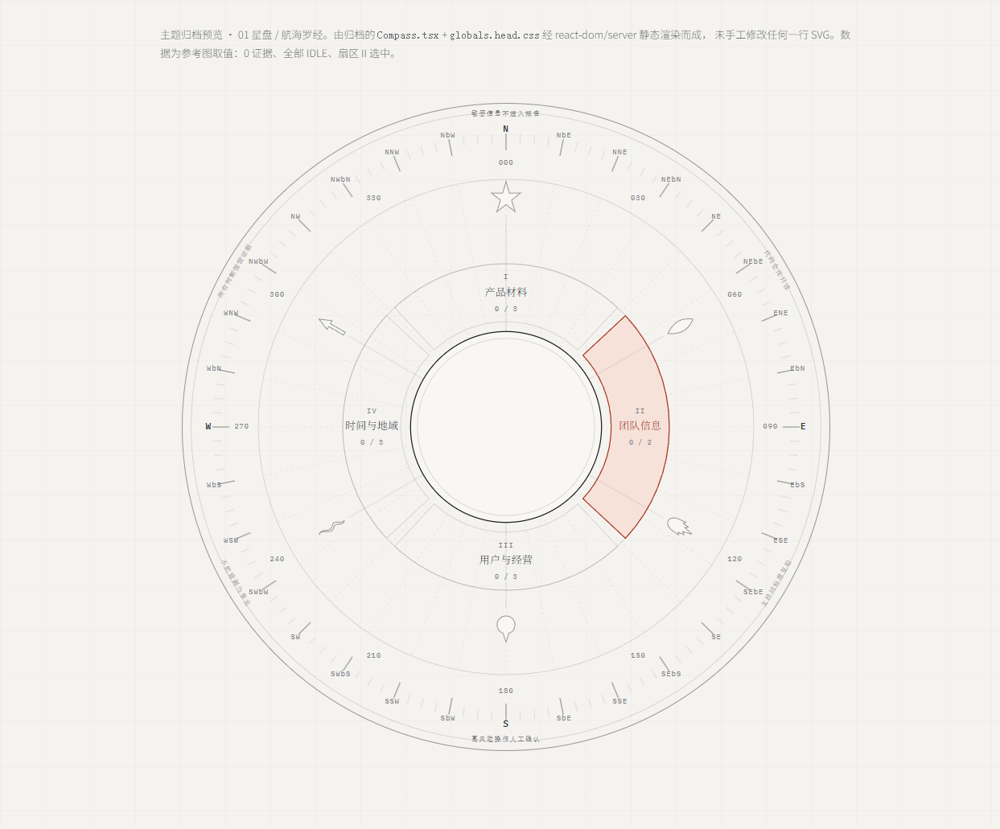

# 01 · 星盘 / 航海罗经



## 是什么

把评审盘做成一台**航海罗经 / 星盘**。沿用星盘的部件语义，换成航海罗经的视觉语言：

| 部件 | 星盘原义 | 在这里的含义 |
|---|---|---|
| MATER 母盘 | 固定底盘 | 边缘刻 360° 与 32 分罗经点，维度刻度 |
| TYMPAN 承盘 | 特定纬度的投影 | 本项目的固定参照系，恒向线 |
| RETE 网盘 | 可转的星图 | 1+5 Agent 判断层，各自有指针 |
| RULE 尺 | 读数尺 | 版本对比尺 |

外缘六句铭文是**信任边界**，不是装饰：

> 所有判断保留证据 · 敏感信息不进入报告 · 代码仓库只读
> 支持同标准复验 · 高风险操作人工确认 · 不把猜测当事实

## 转动机构

瑞士铁路时钟式**棘轮定格**：走到位 → 停 → 等下一个真实事件 → 再走一格。
每一格推进 = 一条证据落库。没有事件，盘面不动。

绝不匀速无限旋转——那是 loading spinner，不是仪器。

RETE 顺时针、MATER 逆时针半速，反向视差是这版观感的核心。

## 视觉

- 米白纸底 + 细黑线框 + 红色克制点缀（仅选中扇区与指针）
- 32 分罗经点用航海标准刻法（N / NbE / NNE / NEbN …），基点全称、其余缩写
- 六种可辨识指针剪影：星 / 叶 / 手 / 球 / 蛇 / 矛。不读文字也能认出是哪个 Agent
- 坐标系 viewBox `-500..500`，容器用 `aspect-ratio` 自适应
- 旋转用 SVG transform **attribute**，不用 CSS transform
  （CSS transform 在 `<g>` 上会与 presentation attribute 冲突）

## 为什么停用

没有留下书面决定。可确认的事实：`Compass.tsx` 至今在仓库里，
但**没有任何文件 import 它**——它是孤儿组件，被 `EvaluationWheel` 取代。

## 文件

| 文件 | 说明 |
|---|---|
| `Compass.tsx` | 组件源码，取自 HEAD `f39f6c1`，未修改 |
| `globals.head.css` | 同期完整 CSS（HEAD 版本，1413 行） |
| `reference.png` | 当时的成品截图 |
| `preview.html` / `preview.png` | 由上面两个文件真实渲染，非临摹 |

## 复活

组件是纯函数，props 见 `CompassProps`。渲染预览：

```bash
cd apps/web
node ../../node_modules/.pnpm/tsx@4.23.11/node_modules/tsx/dist/cli.mjs render-theme-preview.mts
```

注意中心圆在组件里**故意留空**（只画两个圈），参考图中心的项目名 / 0% 由外层覆盖渲染。
这不是渲染缺失。
