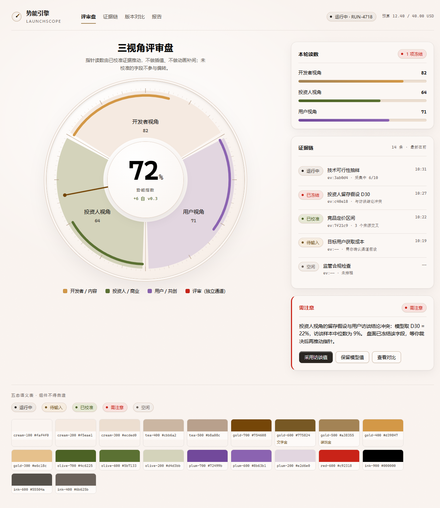

# 03 · 暖奶油仪器（提案）



对应规范：[`docs/design.md`](../../../design.md)

## 是什么

> 一台放在暖色台灯下的黄铜评审仪器，盘面只被真实证据推动。

从参考图逐像素采样得到的暖奶油色系（96–97% 明度带），替换 `02-brass-wheel` 的冷白基调。

核心变化：

1. **色相整体转暖**：`#f3f6f4`（冷白绿灰）→ `#faf4f0`（暖奶油）
2. **三色域分工**：金=开发者/内容，橄榄=投资人/商业，紫=用户/共创
3. **评审红降级为独立通道**：不再是唯一强调色，只表示"需要人来裁决"
4. **金拆成两个 token**：装饰金 `#a38355`（禁止承载文字）/ 文字金 `#775824`（金色文字唯一合法值）
5. **`azure` 改名 `steel` 并保留**：它承载"模型推断 vs 用户确认"的语义，不能删

## 已验证

```bash
python check-contrast.py          # 22/22 PASS，未达标退出码 1
```

- 全部 22 项对比度 ≥ AA 4.5，含 10px 的来源标记
- 色板由 computed token 实时生成，hex 标注**不可能**与实现漂移
- 盘面配色全部走 token（SVG 呈现属性不支持 `var()`，用 CSS 属性接管）
- 来源标记双信道：颜色 + 线型（实线/虚线/点线），色盲用户也能区分

## 文件

| 文件 | 说明 |
|---|---|
| `index.html` | 单文件 demo，零依赖，浏览器直接打开 |
| `check-contrast.py` | 对比度校验，从 index.html 的 token 定义解析颜色 |
| `reference.png` | 参考图（灵感来源） |
| `preview.png` | demo 实际渲染 |

## 状态

**提案，未落地。** 尚未改动 `apps/web`——真正落地需要重写 `globals.css` 的 L1/L2 两层，
且工作区有 62 个既存未提交改动，混在一起会难以回溯。
