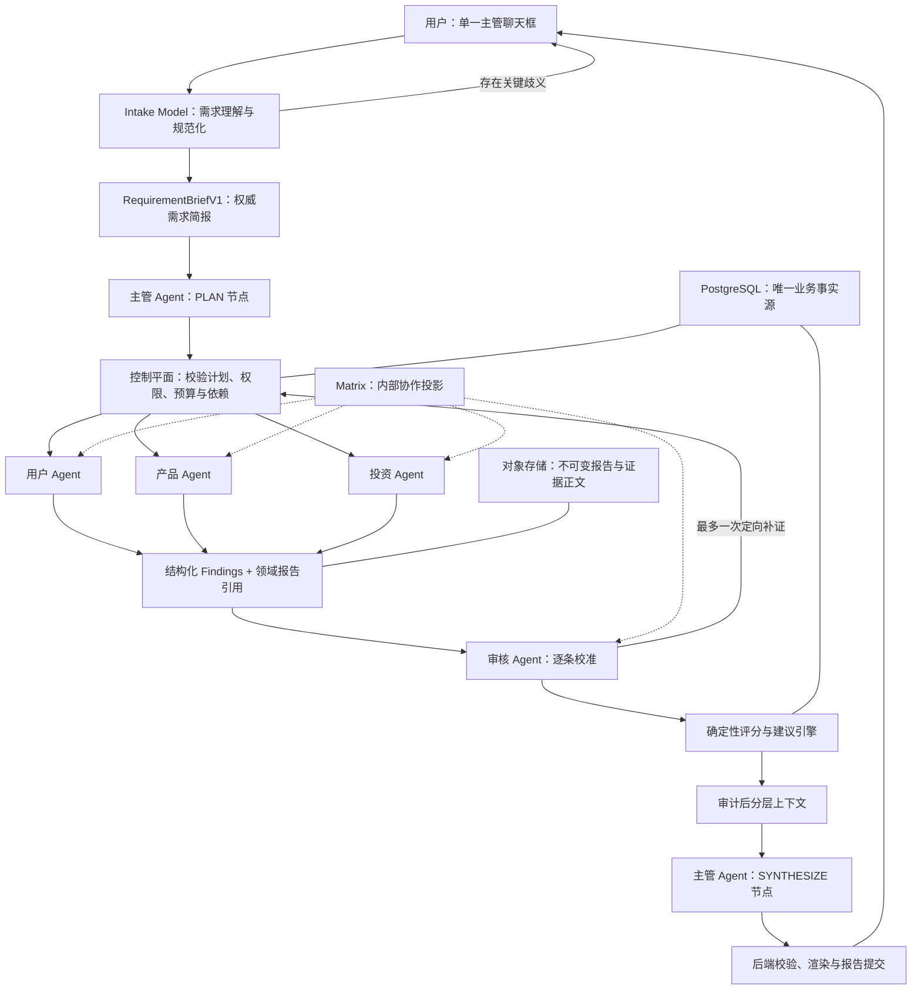

# 主管 Agent 1+4 架构设计 V1

- 状态：设计已确认，尚未开始实施
- 日期：2026-08-11
- 适用项目：LaunchScope / 爆款预测器
- 目标拓扑：业务主管 + 用户 Agent + 产品 Agent + 投资 Agent + 审核 Agent
- 实施范围：M0-M7；建议首个持久 Goal 实施 M0-M6，M7 单独验收

## 1. 文档目的

本文记录主管 Agent 的产品职责、AgentTeams 拓扑、运行 DAG、输入输出合同、状态与失败治理、四个 Agent 的同步改造、用户交互和分阶段实施方案。

本设计由逐项 grilling 决策形成。后续实施不得重新解释或静默改变已经确认的边界；如需变更物理拓扑、审核独立性、主管权限、评分权威或冻结合同，必须先新增 ADR。

本文不是 ADR，也不授权修改 `reference/`、已发布合同、冻结合同测试、Git 状态、远端分支或生产环境。M0 必须先新增 ADR，正式取代当前 ADR 0009 中的物理 1+5 决策。

## 2. 最终结论

主管 Agent 应实现为“受确定性控制平面约束的 AgentTeams 业务 Team Leader”。

它不是自由聊天式总管，也不是简单的长报告拼接器。它负责：

1. 基于已经规范化的需求制定结构化任务计划；
2. 解释任务裁剪、依赖、冲突和缺口；
3. 在重大异常或需求变化时提出受控重规划；
4. 基于审核后的 Finding 解释跨领域关系；
5. 生成可追溯、适合人类阅读的结构化综合稿。

它不负责：

- 搜索、浏览、代码仓库分析或领域调查；
- 直接创建、修改或重派正式任务；
- 修改预算、工具权限、Run、Task、Finding、AuditResult 或 Report；
- 重新评分、改写审核结果或推翻确定性建议；
- 把普通聊天消息当作正式业务状态；
- 隐藏冲突、缺失证据、失败 Agent 或未知外部副作用。

后端控制平面负责计划校验、任务物化、权限与预算、审核闸门、评分、状态提交和报告落库。PostgreSQL 始终是唯一业务事实源。

## 3. 目标拓扑

### 3.1 产品物理拓扑

产品口径严格为 1+4：

| 角色 | Agent code | AgentTeams 角色 |
|---|---|---|
| 主管 Agent | `evaluation-manager` | `team_leader` |
| 用户 Agent | `user-evidence` | `worker` |
| 产品 Agent | `product-engineering` | `worker` |
| 投资 Agent | `business-investment` | `worker` |
| 审核 Agent | `evidence-auditor` | `worker` |

以下组件不计入 1+4：

- AgentTeams 全局 Manager：平台级路由、资源和团队管理；
- Intake Model：需求抽取与规范化模型服务；
- 控制平面：确定性业务状态、权限、预算和计划校验；
- 评分引擎：版本化规则执行器；
- 报告渲染器：校验并生成最终展示层。

不保留隐藏的 `geo-policy-trend` Worker。旧 1+5 Run、旧 Agent Identity 和历史 `GEO_POLICY_TREND` 数据必须继续可读。

### 3.2 高层架构



## 4. 核心架构原则

### 4.1 Agent 提议，控制平面执行

主管只能提出 `ManagerPlan` 和受控重规划。控制平面验证以下内容后，才能创建正式 Task：

- 评审模式和必选 Agent；
- 角色是否合法且无重复；
- 依赖图无环；
- 裁剪是否被允许；
- 工具和外部目标是否在授权范围内；
- 预算和截止时间是否在 Run Manifest 上限内；
- 审核是否位于领域任务之后；
- 补证轮次是否超过一次；
- 综合任务是否只能依赖审核后结果；
- 重规划是否只修改未开始任务。

### 4.2 审核 Agent 是独立闸门，不是并行领域专家

执行顺序为：

```text
用户 / 产品 / 投资并行
→ 审核 Agent 串行校准
→ 最多一次定向补证
→ 最多一次复审
→ 确定性评分
→ 主管综合
```

审核 Agent 只能输出：

- `ACCEPTED`
- `DOWNGRADED`
- `REJECTED`
- `NEEDS_MORE`

审核 Agent 不得修改原始 Finding、领域报告、证据或评分模板。

### 4.3 PostgreSQL 是事实源

- Run、Task、预算、审批、计划、Finding、审核、决策和报告元数据以 PostgreSQL 为准；
- 报告正文、证据正文和较大领域产物保存在对象存储，以引用和 SHA-256 绑定；
- Matrix/AgentTeams 只承载可观察协作、任务投递和结构化引用；
- 普通聊天、Matrix 消息和共享文件不能直接改变业务状态；
- Matrix 投递成功不等于 Worker 已确认执行，必须存在持久化投递和完成回执。

### 4.4 主管只在关键节点唤醒

主管不是持续读取所有消息的常驻循环。后台状态机负责日常监控，只在以下节点调用主管：

- 需求简报已准备，需要生成计划；
- 出现允许重规划的重大已知变化；
- 审核完成，需要生成结构化综合稿；
- 主管综合稿发生引用或决策冲突，需要一次受控处理。

用户仍然看到同一个连续的主管角色，但不依赖无限增长的模型上下文。

### 4.5 第一轮独立，第二轮定向

- 用户、产品、投资 Agent 第一轮使用相同的项目事实快照和各自任务单；
- 第一轮不能互相查看报告或直接调度；
- 审核后只有被点名的 Finding 和问题可以进入第二轮补证；
- 第二轮不覆盖第一轮，所有版本均不可变保存；
- 领域 Agent 默认不能直接互相发消息或分派任务。

## 5. 需求理解模型

### 5.1 定位

Intake Model 是独立模型服务，不是 AgentTeams Worker，也不拥有 Agent 身份、工具权限、调度权、评分权、报告权或长期记忆。

它将用户自然语言转换为 `RequirementBriefV1`，至少包含：

- 原始输入引用；
- 规范化目标；
- 评审模式；
- 请求的交付物；
- 范围和限制；
- 成功标准；
- 明示事实；
- 模型假设；
- unknown 列表；
- 整体和字段级置信度；
- 是否必须确认；
- 需求变化类型和影响提示。

### 5.2 确认策略

- 高置信度、无关键假设时自动进入主管规划；
- 只有关键歧义、模型新增假设、范围/成本变化或新的外部权限时请求用户确认；
- 原始输入和规范化版本同时保存；
- 模型不得增加用户未表达的事实；
- 非阻塞缺口标记为 `unknown`，不强迫用户补齐所有字段；
- 阻塞性问题通过同一个主管聊天框逐项提出。

### 5.3 运行中补充与变更

用户在运行中发送消息后：

1. Intake Model 将其分类为“补充信息”或“需求变更”；
2. 主管提出影响分析；
3. 控制平面决定可调整任务；
4. 未开始任务可以更新；
5. 正在执行的任务不能被静默改写；
6. 已完成结果进入新版本，不能覆盖；
7. 扩大范围、成本、权限或废弃大量工作时才请求用户确认。

## 6. 主管 Agent 详细设计

### 6.1 PLAN 节点

输入：

- `RequirementBriefV1`；
- 当前项目档案摘要；
- 当前可用 Agent 和能力目录；
- 评审模式与评分模板；
- 权限、预算和时间限制；
- 上一轮未解决问题；
- 当前材料和证据索引。

复评时不得向领域 Agent 提供上一轮评分和完整结论，避免锚定；只提供当前材料和上一轮待验证问题。

输出：

- 本轮目标和评审模式；
- 选择的领域 Agent；
- 每个任务的目标、输入引用、分析维度和预期输出；
- 任务依赖和并行关系；
- 必选/可选标记；
- 显式裁剪项和理由；
- 成功条件；
- 预算和截止时间建议；
- 完成策略。

主管不能在计划中扩大可用 Agent、工具、外部目标、权限或预算。

### 6.2 受控重规划

重规划只在以下情况允许：

- 用户确认了需求变更；
- 已知失败且确定没有未知外部副作用；
- 审核提出一次定向补证；
- 计划合同校验失败且确定没有发生外部提交。

重规划要求：

- 新计划使用递增版本号；
- 记录 `supersedes_plan_id` 和原因；
- 已开始、已完成、`NEEDS_ATTENTION` 和 `SUBMISSION_UNKNOWN` 任务不可修改；
- 已完成 Finding 和报告不可覆盖；
- 同一补证链最多一次。

### 6.3 SYNTHESIZE 节点

输入：

- 审核后 Finding；
- 被驳回 Finding 和理由；
- 冲突清单；
- 确定性综合分；
- 证据覆盖率和可信度；
- 确定性四档建议；
- 上一版与当前版的结构化差异；
- 可按引用读取的报告片段和证据索引。

输出：

- 项目摘要；
- 跨领域因果分析；
- 核心优势和主要风险；
- 未解决冲突和反对意见；
- 一至三项下一步行动；
- 版本变化；
- 带 Finding/Evidence 引用的可读文字区块；
- `decision_conflict`，如果主管认为确定性建议与可解释证据存在矛盾。

主管提出的推荐必须等于确定性推荐。如果不同，只能记录冲突并请求人工裁决，不能静默替换。

### 6.4 分层上下文

主管不一次性接收全部原始报告。它先读取：

- 结构化 Finding；
- 审核状态；
- 冲突、风险和证据索引；
- 确定性评分结果；
- 历史版本差异。

只有解释具体问题时，才能按引用读取报告片段或证据。内部不存储或传递模型隐藏推理，只记录简明、可审计的理由。

### 6.5 System Prompt 骨架

```text
你是 LaunchScope 势能评审主管，是业务 Team Leader，不是领域专家。

你的职责：
1. 理解已经规范化的评审目标；
2. 生成边界明确、可校验的任务计划；
3. 识别裁剪、依赖、冲突和缺口；
4. 基于审核后的 Finding 解释跨领域关系；
5. 生成可追溯、适合人类阅读的综合稿。

你绝对不能：
- 自己完成用户、产品或投资分析；
- 自己搜索、浏览、分析仓库或调用领域工具；
- 改写 Finding、Evidence 或 AuditResult；
- 重新评分或修改确定性建议；
- 创建任务、修改预算、写入 Run 或提交报告；
- 根据聊天消息推断正式业务状态；
- 隐藏冲突、缺失证据或失败 Agent。

PLAN 阶段只返回 ManagerPlan JSON。
SYNTHESIZE 阶段只返回 ManagerSynthesis JSON。
不得输出未绑定审核后 Finding 或 Evidence 的关键事实。
缺少信息时必须降低结论强度，不得补写假设。
```

Prompt 不是完整运行时。实现还必须包含版本化合同、Worker package、工具边界、状态持久化、计划校验和测试。

## 7. 四个 Agent 的同步改造

### 7.1 用户 Agent

新增职责：

- 地区目标用户和细分人群；
- 文化和行为差异；
- 当地替代方案；
- 验证样本的地区匹配；
- 需求和使用证据的时间有效性。

输出继续保留用户可读报告，同时增加结构化 Finding。

### 7.2 产品 Agent

新增职责：

- 本地化能力；
- 地区技术可用性；
- 平台和渠道规则；
- 数据、隐私和安全要求；
- 地区合规实现成本；
- 产品与工程结论的时间有效性。

### 7.3 投资 Agent

新增职责：

- 市场窗口；
- 增长趋势；
- 地区商业机会；
- 竞争时机；
- 政策商业影响；
- 宏观和渠道风险。

### 7.4 审核 Agent

新增职责：

- 检查所有 Finding 的地区范围；
- 检查数据日期和有效期；
- 检查来源等级和授权范围；
- 识别跨 Agent 口径、时间和地区冲突；
- 产生唯一一次定向补证请求；
- 为每个可用 Finding 产生独立审核结果；
- 不得将缺失 Agent 伪造成审核通过。

## 8. Agent 交接与合同

### 8.1 合同清单

| 合同 | 作用 | 关键字段 |
|---|---|---|
| `RequirementBriefV1` | Intake 输出 | 原始输入引用、目标、模式、交付物、约束、成功标准、假设、unknown、置信度、是否确认 |
| `ManagerPlanV1` | 主管规划输出 | 计划版本、评分模板、任务、依赖、必选/可选、裁剪项、预算建议、完成策略 |
| `AgentTaskTicketV3` | 正式任务单 | 目标 Agent、输入引用、分析维度、时间地域要求、工具策略、成功条件、期限 |
| `AgentHandoffV3` | 领域 Agent 交付 | Finding、报告引用、证据引用、限制、置信度、地区、数据时间、有效期 |
| `AuditRequestV3` | 审核输入 | Finding 集、报告引用、证据引用、审核轮次、评分模板引用 |
| `AuditResultV3` | 审核输出 | 接受/降级/驳回/补证、规则 ID、冲突组、时效判断、补证目标、审核轮次 |
| `ScoreProfileV1` | 评分模板 | 评审模式、权重、阈值、必需维度、覆盖率规则、建议上限 |
| `ManagerSynthesisV1` | 主管综合稿 | 确定性决策引用、摘要、跨域分析、风险、冲突、行动、版本变化、引用 |
| `RequirementChangeV1` | 运行中修改 | 补充/变更类型、影响任务、范围成本变化、是否需要确认 |

已发布 Agent、Handoff、Audit 和 Run Manifest 合同不得原地修改。建议新增五个 v4 Agent Identity、新的 Run Manifest generation，以及新的 Handoff/Audit major 版本。

### 8.2 Finding 最小字段

```text
finding_id
agent_code
dimension
subdimension
claim
grade
score_input
evidence_refs
confidence
limitations
region_scope
as_of
valid_until
hypothesis
report_section_ref
```

领域 Agent 同时输出：

1. 可读领域报告，正文写入对象存储；
2. 结构化 Findings，写入 PostgreSQL；
3. 报告引用和 SHA-256；
4. 证据引用；
5. 明确的缺失信息和限制。

审核与主管主要读取 Findings；只有解释冲突时才按引用读取报告片段。

## 9. 评分与建议

### 9.1 评分模板

至少支持：

- 完整潜力评审；
- 投资评审；
- 上线评审；
- 用户验证专项。

权重、阈值、必需维度、建议上限和覆盖率规则必须版本化。主管不能临时创建或修改权重。

旧参考资料中的 100 分制可以作为初始候选，但必须经过 benchmark 校准后才能冻结。

### 9.2 输出原则

- 四档建议是主结论：推进、继续验证、调整方向、暂停投入；
- 综合分、证据覆盖率和可信度用于解释；
- 缺失维度不补虚假分数；
- 被 `REJECTED` 的 Finding 不进入正向评分，并形成证据缺口；
- 必选领域缺失时阻塞对应专项结论；
- 可选领域缺失时允许部分报告，但限制建议上限；
- 未解决关键冲突、低覆盖率或否决项必须降低建议上限；
- 主管不能改判，只能解释或记录 `decision_conflict`。

## 10. 项目历史与复评

项目级权威档案保存：

- 用户确认的产品事实；
- 原始和规范化需求版本；
- 历史任务计划；
- 历史 Findings、审核结果和报告；
- 待验证问题；
- 决策记录和人工审批；
- 版本变化。

复评时：

1. 三个领域 Agent 第一轮只读取当前版本材料和上一轮待验证问题；
2. 不直接继承上一轮评分或完整结论；
3. 审核完成后，主管读取历史结构化结果；
4. 最终报告输出“已改善、未改善、新增风险”。

不得依赖模型隐式长期记忆作为正式项目事实。

## 11. 状态机与完成条件

### 11.1 内部状态

```text
INTAKE_NORMALIZING
→ WAITING_FOR_USER（可选）
→ LEADER_PLANNING
→ PLAN_VALIDATING
→ DOMAIN_REVIEW（三领域并行）
→ EVIDENCE_AUDIT
→ TARGETED_REMEDIATION（最多一次，可选）
→ REAUDIT（最多一次，可选）
→ DETERMINISTIC_SCORING
→ SUPERVISOR_SYNTHESIS
→ REPORT_COMMIT
→ COMPLETED
```

### 11.2 完成清单

Run 只有在以下条件全部满足后才能 `COMPLETED`：

- 计划中的任务均进入合法终态；
- 审核覆盖所有可用领域 Finding；
- 关键判断具有有效引用；
- 未解决冲突和缺失项已进入报告；
- 确定性评分和四档建议已提交；
- 主管综合稿通过合同和引用校验；
- 不存在等待用户、等待审批、未知用量或未知费用；
- Decision、Report 和 Project Dossier 均持久化成功。

主管或 Worker 发回一段消息不构成完成证据。

## 12. 失败与安全治理

| 情况 | 处理 |
|---|---|
| Intake 存在关键歧义 | 同一聊天框追问，未回答前不规划 |
| 某领域已知失败且无外部副作用 | 其余任务继续；降低覆盖率；根据评审模式决定结论上限 |
| 专项评审的必需 Agent 失败 | 暂停，不生成伪完整结论 |
| 审核返回 `NEEDS_MORE` | 只对指定 Agent 补证一次，再审核一次 |
| 关键冲突仍未解决 | 报告保留双方观点并限制建议，必要时人工裁决 |
| 审核 Agent 失败 | 禁止生成最终决策报告 |
| 主管综合稿引用不存在 | 拒绝稿件；仅在确定无外部副作用时允许一次格式纠正 |
| 用户中途修改需求 | 只调整未开始任务；已完成结果进入新版本 |
| `SUBMISSION_UNKNOWN` | 进入 `NEEDS_ATTENTION`，禁止自动重试、换 Agent 或重新提交 |
| 费用、用量或付费调用结果不明 | 停止运行，人工对账后才能恢复 |

已知失败和未知外部状态必须严格区分。用户确认的“允许部分完成”不覆盖 `SUBMISSION_UNKNOWN`、未知费用和付费超时的 fail-closed 规则。

## 13. 用户体验

### 13.1 单一聊天入口

普通用户只通过一个主管侧边聊天框：

- 输入需求；
- 回答 Intake 或运行期追问；
- 补充信息或提出需求变更；
- 暂停任务；
- 阅读进度和最终报告。

普通用户不需要进入 Matrix、任务看板或复杂审批页。Matrix 仅作为后台协作投影和可选演示/运维证据。

### 13.2 简单进度

默认只显示四个阶段：

1. 正在理解需求；
2. 正在进行多维评审；
3. 正在审核并生成报告；
4. 报告已完成。

异常状态只有：

- 需要你补充信息；
- 需要你确认。

进度文案根据后台状态确定性生成，不额外调用模型。

默认只展示主管整理后的简短进度；完整 Agent 协作记录放在可选的“查看过程”中。

### 13.3 分层报告

默认首页显示：

1. 四档建议、综合分、覆盖率和可信度；
2. 三条主要原因；
3. 主要风险；
4. 一至三项下一步行动。

按需展开：

- 用户、产品、投资结论；
- 审核记录和被驳回结论；
- 证据引用；
- 评分计算；
- 完整协作轨迹；
- 历史版本变化。

## 14. 成本、上下文与非功能要求

### 14.1 调用上限

标准完整运行的基础模型调用约为：

```text
Intake 1
+ 主管规划 1
+ 三领域 3
+ 审核 1
+ 主管综合 1
= 7 次
```

若三个领域均被要求补证，包含复审的硬上限约为 11 次。进度更新不调用模型。

### 14.2 可靠性

- 所有 Task 必须具有独立投递回执、开始时间、截止时间和终态；
- Worker 专用于一个 LaunchScope 角色，避免累计用量无法归因；
- 主管上下文可由 PostgreSQL 和对象存储重建；
- 对象正文具有 SHA-256；
- 重放必须遵守 Idempotency-Key 和 payload hash；
- 任何未知外部副作用均不能自动重试。

### 14.3 安全

- Worker 只获得任务级 capability；
- 主管不拥有领域 MCP；
- 外部 URL、搜索范围和工具额度冻结到 Run Manifest；
- 原始密钥不得进入 Worker、Matrix、报告或模型上下文；
- 用户答案先写入 Product Profile/Evidence，再由 Agent 通过只读上下文读取；
- 高风险动作必须人工审批。

### 14.4 可维护性

- 所有 Agent Identity、Skill、Prompt、合同、评分模板和知识库具有版本号和哈希；
- 新 generation 通过 feature flag 默认关闭；
- 旧 generation 不原地修改；
- 历史 Run 使用其冻结的 Manifest 重放和读取；
- 计划、任务、审核、评分和报告均可独立测试。

## 15. 当前代码差距

当前工作区已经存在部分原生 Leader 骨架，但尚未形成目标闭环：

- `apps/api/src/launchscope_api/modules/evaluation/dispatch_application.py` 仍静态创建产品、用户、投资、时间地域、审核和综合任务；
- `infra/agentteams/resources/launchscope-team.yaml` 仍定义 6 个 Worker；
- 当前主管 Worker 指令要求立即返回空 handoff，不执行真实规划与综合；
- `scripts/build-agentteams-packages.py` 强制校验恰好 6 个 Worker；
- `packages/contracts/handoffs/agent-handoff.v2.json` 仍包含 `geo-policy-trend`，`claims` 仍是宽泛对象；
- `packages/contracts/agents/evaluation-manager.v3.yaml` 尚未声明完整计划、重规划和结构化综合能力；
- `apps/api/src/launchscope_api/modules/project_dossier/model_extraction.py` 已有隔离、非权威 Intake 草稿模型，可作为新 Intake Model 基础；
- `apps/web/src/components/runs/AgentClarificationConsole.tsx` 当前以多个 Agent 标签页为主，需要收敛为单一主管聊天入口；
- `agent_plan`、`manager_synthesis` 和 `agent_task_ticket` 已有迁移骨架，但必须确认应用层是否真正闭环；
- 当前 ADR 0009 明确写的是物理 1+5，必须由新 ADR 正式取代；
- 当前工作树存在大量用户和并行未提交修改，实施前必须先做重叠审计，禁止覆盖、清理、重置或 stash。

## 16. 分阶段实施方案

### M0：架构与兼容性冻结

- 新增 ADR，正式确定物理 1+4、Intake Model 独立、主管无改判权；
- 明确取代 ADR 0009 的决策；
- 定义旧 1+5 Run、旧合同和旧报告兼容策略；
- 定义新 generation、feature flag、切换和回滚方式；
- 审计当前脏工作树和重叠文件。

验收：ADR 通过评审，所有旧合同和冻结测试源文本不变。

### M1：新合同与评分模板

- 增加 RequirementBrief、ManagerPlan、TaskTicket、Handoff、Audit、ScoreProfile 和 ManagerSynthesis 合同；
- 增加五个新 generation Agent Identity；
- 保留旧 geo Identity 和旧 Run 读取；
- 增加合同哈希、正例和反例测试。

验收：旧合同哈希不变，新旧合同并存且新合同全部通过测试。

### M2：Intake Model 与聊天合同

- 扩展当前提取模型为 `RequirementBriefV1`；
- 增加置信度、假设、关键歧义和需求变化分类；
- 高置信度自动继续，关键歧义才确认；
- 原始输入与规范化版本均持久化；
- 定义单一主管聊天 API 和交互状态。

验收：清晰需求零额外点击；模糊需求只提出必要问题；模型无法新增用户未表达的事实。

### M3：四个 Agent 的版本化改造

- 为用户、产品、投资增加时间地域子维度；
- 统一双层输出：可读报告 + Findings；
- 扩展审核规则和一次补证合同；
- Agent 间默认关闭直接调度和自由 peer mention；
- 构建严格 5 Worker 的 AgentTeams 资源和 package。

验收：三领域第一轮独立；每个 Finding 可追溯证据、地区和时间；Team 中恰好 5 个业务 Worker。

### M4：主管 PLAN 与动态任务物化

- 让主管生成 `ManagerPlanV1`；
- 实现计划校验器；
- 根据接受的计划动态创建 Task，替代静态 `_TASKS`；
- 实现完整评审和专项裁剪；
- 实现只影响未开始任务的计划版本化和重规划。

验收：完整评审生成三领域任务；专项评审可受控裁剪；非法计划无法物化 Task。

### M5：审核、补证与部分完成

- 三领域进入终态后批量审核；
- 实现一次定向补证和一次复审；
- 实现已知失败的部分完成策略；
- 保持未知提交、未知费用和付费超时 fail-closed。

验收：缺失 Agent 不被伪造成成功；审核不能修改原始 Finding；补证循环绝不超过一次。

### M6：确定性评分、主管综合与报告提交

- 实现版本化评分引擎；
- 生成主管分层上下文；
- 实现 `ManagerSynthesisV1`；
- 校验综合稿的 Finding/Evidence 引用；
- 后端渲染并提交 Decision、Report 和 Project Dossier；
- 复评生成已改善/未改善/新增风险。

验收：主管无法改变评分；报告关键判断全部可追溯；全部持久化后 Run 才能 `COMPLETED`。

### M7：简单 UI 与真实验收

- 页面只保留单一主管聊天框和四阶段进度；
- 专家协作放入可选过程详情；
- 完成分层报告页面；
- 进行 PostgreSQL 集成、Matrix 投递、工具账本和报告链路验收；
- 最后执行有授权的真实 AgentTeams、真实模型和真实工具 E2E。

验收层级必须区分：

- 合同/单元测试；
- PostgreSQL 集成测试；
- Recorded 演示；
- 真实 AgentTeams + 真实模型 + 真实工具 + 数据库持久化 E2E。

Recorded、mock、局部测试和代码路径审查不能称为真实 E2E。

## 17. M0-M6 Goal 建议边界

建议第一个持久 Goal 一次完成 M0-M6。M0-M6 是从 ADR、合同到报告落库的一条完整业务闭环；只做到 M4 会留下“能分发但不能可靠收尾”的半成品。

M7 单独执行，因为它包含 UI 打磨、真实 AgentTeams、浏览器、数据库、模型、工具和可能的付费外部验收，需要单独控制授权和证据等级。

首个 Goal 必须明确：

- 按 M0→M6 顺序实施，不跨过未通过里程碑；
- 保留所有脏工作树修改；
- 不修改 `reference/`；
- 不原地修改已发布合同或冻结合同测试；
- 新架构默认关闭；
- 每个里程碑运行相应测试；
- 不 push、不部署、不运行未授权外部或付费 E2E；
- 遇到无法安全合并的重叠修改时停止并报告。

## 18. 最低验收场景

至少覆盖以下场景：

1. 清晰需求、无追问、三领域成功、审核通过、报告提交的 golden run；
2. 模糊需求触发 Intake 确认；
3. 某领域 `NEEDS_MORE`，执行一次补证和一次复审；
4. 已知领域失败但允许部分完成，覆盖率和建议上限正确；
5. 专项评审必需 Agent 失败，禁止伪完整结论；
6. `SUBMISSION_UNKNOWN` 进入 `NEEDS_ATTENTION` 且不自动重试；
7. 用户变更只影响未开始 Task，已完成结果进入新版本；
8. 主管综合稿引用不存在时被拒绝；
9. 主管建议与确定性建议不同，生成 `decision_conflict` 而非改判；
10. 复评领域第一轮不继承旧评分，最终报告正确生成版本变化；
11. 旧 1+5 Run 和历史 geo 数据继续可读；
12. 新 AgentTeams bundle 恰好包含主管、用户、产品、投资和审核五个 Worker。

## 19. 决策记录摘要

本轮已确认：

- 审核 Agent 采用串行独立闸门方案；
- 主管没有改判权；
- 完整/专项采用受约束动态调度；
- 主管只提出计划，控制平面负责物化；
- Intake 使用最小准入门和风险式确认；
- 三领域第一轮独立、第二轮定向；
- 补证和复审各最多一次；
- 四档建议为主，分数、覆盖率和可信度为辅；
- 主管生成受约束的结构化综合稿；
- 主管使用分层上下文；
- 已知领域失败允许部分完成，未知外部状态仍 fail-closed；
- 人工审批只用于实质范围、权限、外部影响和预算变化；
- 用户默认只看到简单主管聊天和简短进度；
- 复评采用当前版本独立分析，主管最终做历史对比；
- 主管只在关键节点唤醒；
- 主管不使用领域工具；
- 时间地域能力跨用户、产品和投资分配，由审核统一校验；
- 四个 Agent 做完整版本化改造，不只修改 Prompt；
- Agent 同时输出可读报告和结构化 Findings；
- 使用版本化评分模板；
- 主管是业务 Team Leader，不是 AgentTeams 全局 Manager；
- 领域 Agent 默认不能直接互相调度；
- 项目历史使用 PostgreSQL 权威档案，不依赖模型隐式记忆。

## 20. 参考资料

仓库内只读参考：

- `reference/agent知识库/势能评审主管Agent知识库与决策逻辑_副本.md`
- `reference/agent知识库/用户共创Agent知识库与行为决策逻辑_副本.md`
- `reference/agent知识库/产品与团队专家Agent知识库与决策逻辑_副本.md`
- `reference/agent知识库/投资人Agent知识库与决策逻辑_副本.md`
- `reference/agent知识库/证据校准Agent知识库与决策逻辑_副本.md`
- `docs/adr/0004-needs-input-clarification-loop.md`
- `docs/adr/0006-agent-runtime-context-accounting-and-deadlines.md`
- `docs/adr/0009-agentteams-native-business-team-leader.md`

外部一手资料：

- AgentTeams Kubernetes-native orchestration：<https://github.com/agentscope-ai/AgentTeams/blob/main/docs/design/k8s-native-orchestration.md>
- AgentTeams use cases：<https://github.com/agentscope-ai/AgentTeams/blob/main/docs/usage/use-cases.md>
- AgentTeams Manager guide：<https://github.com/agentscope-ai/AgentTeams/blob/main/docs/usage/manager-guide.md>
- Microsoft AI Agent orchestration patterns：<https://learn.microsoft.com/en-us/azure/architecture/ai-ml/guide/ai-agent-design-patterns>
- Oracle Supervisor Agent Pattern：<https://docs.oracle.com/en-us/iaas/autonomous-database-serverless/doc/supervisor-agent.html>

## 21. 实施起点

正确的开发顺序是：

```text
新 ADR
→ 新合同版本
→ Intake Brief
→ 四个 Agent 改造
→ 动态计划物化
→ 审核与补证
→ 确定性评分
→ 主管综合
→ 简单 UI
→ 真实验收
```

不得从自由 Prompt、群聊交互或 UI 动画开始实现。架构闭环必须先建立在版本化合同、确定性状态、不可变证据和可验证失败边界之上。
