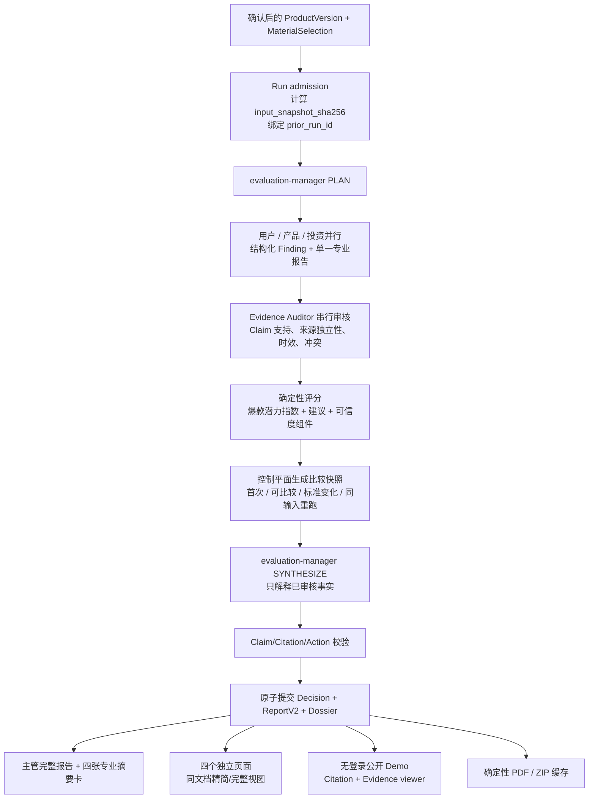

# LaunchScope v2.2 Skill 与报告架构设计

- 状态：产品决策已确认，等待实施
- 日期：2026-08-13
- 关联决策：`docs/adr/0020-report-v22-baseline-citations-public-demo.md`
- 参考输入：`reference/launchscope-skills-v2.1/`（冻结、只读）

## 1. 目标与非目标

### 1.1 目标

在现有 LaunchScope generation-v5 物料路由和主管 1+4 链路上，交付以下闭环：

1. 主管 Agent 默认输出一份完整、可核验的详细综合报告；
2. 四个子 Agent 各提交一份已审计的结构化报告，并渲染成精简版/完整版；
3. 每条关键结论带内联引用，引用可以打开公开网页、论文或 Demo Evidence 原文；
4. 新版产品再次预测时，在报告首屏解释“相比上一次”的真实变化；
5. 首次预测、同内容重跑和标准变化不会生成误导性涨跌；
6. Web、公开 Demo、PDF 和完整报告包共用同一份不可变结构化事实；
7. 方案复用当前 PostgreSQL、对象存储、FastAPI、Next.js、AgentTeams 和现有报告路由，不另建旁路系统。

### 1.2 非目标

- 不把爆款潜力指数描述成概率或“爆率”；
- 不在 v2.2 增加“放弃”建议；
- 不改变主管无评分权、无审核改写权的边界；
- 不把 v2.1 的 8 个静态 HTML 当业务事实；
- 不允许渲染失败后手工拼 JSON、使用 OfferPilot 等占位数据或再次调用模型补报告；
- 不修改 `reference/`、已发布合约或冻结合同测试；
- 不把 Recorded、fixture 或浏览器投影测试称为 Live E2E。

## 2. 已确认的产品规则

| 主题 | 最终规则 |
|---|---|
| 顶层名称 | 永久使用“爆款潜力指数” |
| 首次预测 | 不显示“相比上一次”、V1/V2 或“首次评估”占位 |
| 再次预测 | 同项目、正式完成、产品输入发生变化后才出现历史信息 |
| 标准变化 | 显示“评估标准已更新，暂不可直接比较”，不显示分数涨跌 |
| 顶卡顺序 | 爆款潜力指数 → 当前阶段 → 条件性相比上一次 → 结论可信度 → 当前建议 |
| 可信度 | 顶卡只突出结论可信度；证据覆盖度作为解释行 |
| 建议 | `继续`、`继续验证`、`改方向`、`暂停` 四种确定性映射 |
| 指数解释 | 显示维度贡献、加分项、扣分项；计算细节可展开 |
| 主管报告 | 默认完整展示，不是摘要卡或四份报告拼接 |
| 子报告 | 主管页底部四张摘要卡，进入独立页面 |
| 精简/完整 | 同一结构化报告的两种视图，不分别生成 |
| 引用 | 关键 Claim 后 `[1][2]`，点击展开；末尾完整来源目录 |
| 无引用判断 | 标记“待验证判断”，不参与指数和强建议 |
| 审计用语 | 默认中文人话；内部码、ID、哈希放审计详情 |
| Demo 权限 | 无需登录；所有材料可进入公开 Evidence 链 |
| 上传确认 | 第一次上传只出现一个“我已了解，继续上传”按钮 |
| 导出 | 五份报告分别 PDF；一键报告包；Evidence 原件可选 |

## 3. 当前代码与目标的差距

### 3.1 已有能力，可以直接复用

| 已有能力 | 当前代码 | v2.2 用法 |
|---|---|---|
| 1+4 严格执行顺序 | `apps/api/src/launchscope_api/modules/supervisor/` | 保持三领域并行、审核串行、评分后综合 |
| 确定性指数 | `completion_application.py::DeterministicScoringEngine` | 展示为爆款潜力指数，主管只解释 |
| Run 基线字段 | `evaluation_run.baseline_run_id` | 扩展到正式 full evaluation 的稳定历史绑定 |
| 历史比较 API | `ExperienceReadApplication.compare_runs` | 升级为已绑定基线的 ReportComparisonV1 |
| 不可变主管报告 | `report.object_key` + `sha256` | 存储 SupervisorReportDocumentV2 |
| 四份 Agent 报告目录 | `agent_report_artifact` | 存储 SpecialistReportDocumentV2 |
| 子报告独立页面 | `/runs/[runId]/agent-reports/[agentCode]` | 保留路由，增加精简/完整版切换 |
| Finding→Evidence | `finding_evidence`、`EvidenceChain` | 扩展为 Claim→Citation→SourceLocator |
| Evidence 元数据 | `evidence` 表的类型、哈希、时间、地区、信任等级 | 增加面向人的来源定位信息 |
| 公开 Demo 主管页 | `/shared/demo/[token]/reports/[reportId]` | 扩展到 Agent 报告与 Evidence viewer |
| Playwright | API 已依赖 `playwright==1.61.0` | 复用打印路由生成 PDF，不引入第二浏览器栈 |

### 3.2 当前缺口

1. `user-report-formatter.ts` 默认将原因、行动和缺口压缩为三条，并会以通用中文替代英文内容；它适合旧报告兼容，不适合作为 v2.2 事实生成器。
2. `SupervisorLayeredReport.tsx` 只显示结论、原因、机会、风险和行动；原始综合、审计和 Evidence 链只在 `debug=1` 下出现。
3. `manager-synthesis.v1.json` 的引用只有 `{kind, ref}`，不能把一句 Claim 绑定到来源标题、URL、页码和审计状态。
4. `EvidenceChain` 在 `readOnly` 模式隐藏 Evidence 打开按钮，和已确认的公开 Demo 冲突。
5. `agent-reports.v4.yaml` 是私有 API；公开 Demo 没有 Agent 报告、Evidence viewer 或 Agent PDF 路径。
6. `baseline_run_id` 的数据库约束只允许 `USER_EVIDENCE_RECHECK`，普通第二次完整预测不会稳定绑定基线。
7. `report()` 当前按读取时的最新历史决定部分 dimension change，不能保证报告重放不变。
8. 当前 `coverage` 是“有可用结论的 Agent 数 / 计划 Agent 数”，不能等同于用户理解的 Evidence 覆盖度。
9. 当前 `confidence` 直接由 `evidence_quality` 换算，尚未明确纳入独立来源、时效和冲突。
10. 产品/投资 AgentTeams 包中的 allowed Skill 别名仍主要复用通用 handoff Skill，没有生产级 PTA/BIA 结构化报告 runtime。
11. 当前只有用户验证报告的 HTML/Markdown 下载，没有五份 PDF 和报告包。
12. 当前主管报告读取路径主要从 Decision/Synthesis 重建投影，没有把已提交的 `report.object_key` 正文作为 v2 用户报告的唯一读取正文。

## 4. 借鉴 v2.1 的范围

### 4.1 借鉴

- 一份主管完整报告加四份专业依据；
- 子 Agent 精简/完整双层阅读；
- 用户报告的细分人群、使用/不使用原因和验证实验；
- 产品报告的阶段门、核心流程、交付风险和团队单点风险；
- 投资报告的商业模型、单位经济、红队问题、继续/暂停门槛；
- 证据报告的来源独立性、冲突、降级和补证建议；
- 行动项的目标、原因、责任人、期限、成功/失败条件；
- 卡片、表格、打印和移动端层级。

### 4.2 不借鉴

- iframe 嵌入；
- 8 个分别生成的 HTML；
- demo renderer 作为生产 renderer；
- 渲染失败后手工构造 JSON；
- 主管从子 Agent 原始分数自由算总分；
- 首次报告显示“相比上一次：首次评估”；
- 没有 URL/页码的“可追溯”声明；
- 无来源的市场、竞品、法律或合规断言；
- 默认向普通用户暴露内部状态码和 Finding ID。

## 5. 目标架构



### 5.1 不变的权威边界

- PostgreSQL：Run、基线、Finding、Audit、Decision、Report、分享和导出元数据；
- 对象存储：不可变 Evidence、Agent 报告、主管报告和导出文件正文；
- AgentTeams/Matrix：任务、回执和对象引用，不写业务状态；
- 评分引擎：爆款潜力指数和四类建议；
- Evidence Auditor：证据是否足以进入正式结论；
- Supervisor：跨角色解释、冲突呈现、行动组织，不改分、不改审核。

## 6. v2.2 能力包与 Skill 映射

“v2.2”是能力包版本。实施后由 `RunManifestV6` 固定以下独立版本；下表版本号是目标建议，最终以新文件和哈希为准。

| 角色 | 当前真实落点 | v2.2 目标 | 关键输出 |
|---|---|---|---|
| 主管 | `evaluation-manager.v5.yaml` + `ManagerSynthesisV1` | `evaluation-manager.v6.yaml` + `ManagerSynthesisV2` | 结构化 Claim、跨域推理、ActionGate、Citation refs |
| 用户 | `packages/user-validation-designer` | 新 minor 版本 | 人群、任务、行为、付费/留存证据、验证计划、单一 SpecialistReportV2 |
| 产品 | `browser-product-audit@1.0` + 通用 handoff | 新增 `packages/product-technical-audit` | 阶段门、核心流程、技术/交付风险、复验门槛 |
| 投资 | `business-investment-assessment@1.0` + 通用 handoff | 新增生产级 `packages/business-investment-assessment` runtime | 商业模型、单位经济、竞争、合规限定、投入门槛 |
| 审核 | `packages/evidence-grounding-audit` | 新 minor + `AuditResultV4` | 支持强度、独立来源数、时效、冲突、补证 |

### 6.1 主管输出规则

- 接收确定性 score、已审核 Finding、Comparison snapshot 和 Citation catalog；
- 每个事实性 Claim 只能引用输入 catalog 中的 citation ID；
- 不得输出新的市场数字、法律结论或竞品事实；
- `PENDING_VALIDATION` Claim 只能进入缺口/行动，不得解释为评分原因；
- Action 必须包含做什么、为什么、责任人、期限、成功标准、失败条件、需要补的 Evidence；
- 首次预测输出不含 comparison section。

### 6.2 用户 Skill 借鉴项

- 目标人群与排除人群；
- 高频场景与真实替代方案；
- 使用、放弃、再次使用、付费的原因；
- 样本量、分群、观察窗口和模拟 Evidence 标识；
- 下一轮验证计划必须有可观察成功标准；
- 不使用 5 人样本宣称统计显著。

### 6.3 产品 Skill 借鉴项

- 阶段适配：概念/MVP/早期商业化/增长；
- 关键用户流程和失败点；
- 可用性、稳定性、安全、依赖和团队 bus factor；
- 团队自述架构只能标为“待代码/运行证据验证的设计声明”；
- 产品阶段门必须可执行、可复验。

### 6.4 投资 Skill 借鉴项

- 收入结构、价格、成本、毛利、获客和续费；
- 假设与事实分列；
- 市场、竞争和法律 Claim 必须有地区、时间和来源；
- 缺少数据时输出区间/待验证，不生成伪精确结论；
- 明确继续投入、限制投入和暂停条件。

### 6.5 审核 Skill 借鉴项

- 去重同源转载，计算独立来源而非链接数量；
- 判断 Evidence 是否真的支持 Claim，而非只判断“存在链接”；
- 区分支持证据、反证和背景资料；
- 证据不足时输出 `NEEDS_MORE`/`REJECTED`，阻断 score_input；
- 默认 UI 映射成人话，原始审计信息完整保留。

## 7. 合约设计

### 7.1 `ManagerSynthesisV2`

新增 `packages/contracts/manager/manager-synthesis.v2.json`，不修改 v1。核心形状：

```json
{
  "schema_version": "2.0",
  "run_id": "uuid",
  "deterministic_decision_ref": "uuid",
  "summary_claim_id": "claim-supervisor-summary",
  "claims": [
    {
      "claim_id": "claim-001",
      "section": "CROSS_DOMAIN",
      "text": "真实付费已出现，但续费证据不足。",
      "status": "VERIFIED",
      "decision_relevance": "CRITICAL",
      "citation_ids": ["citation-001", "citation-002"]
    }
  ],
  "actions": [
    {
      "action_id": "action-001",
      "title": "验证续费",
      "owner": "项目负责人",
      "deadline_days": 14,
      "success_criteria": ["10 名目标用户中至少 3 名续费"],
      "failure_triggers": ["0 名续费或核心任务完成率低于 50%"],
      "required_evidence": ["订单记录", "用户回访记录"],
      "related_claim_ids": ["claim-001"]
    }
  ],
  "decision_conflict": false
}
```

规则：`CRITICAL + VERIFIED` 必须至少一个有效 citation；`PENDING_VALIDATION` 的 `citation_ids` 可为空，但不能出现在 score contribution 或 recommendation rationale 中。

### 7.2 `SupervisorReportDocumentV2`

后端将确定性字段和已验证 synthesis 合并成不可变正文：

```text
identity
top_card
comparison (optional)
highlights[]
critical_issues[]
role_summaries{user, product, investment}
cross_domain_claims[]
actions[]
confidence_breakdown
agent_report_cards[]
citations[]
source_directory[]
audit_detail_ref
```

`top_card.potential_index`、`recommendation`、`comparison.delta` 和 `confidence_breakdown` 全由控制平面填充，Supervisor 不能提交这些权威值。

### 7.3 `SpecialistReportDocumentV2`

四个 Agent 共用外壳，`domain_payload` 按角色扩展。摘要/完整版由同一字段选择器渲染：

```text
identity + agent_code + source_sha256
executive_summary
metrics
claims[]
domain_payload
risks[]
actions[]
citations[]
source_directory[]
audit_summary
raw_audit_refs
```

摘要视图读取 `executive_summary`、核心 metrics、Top Claims/Risks/Actions 和关键 citations；完整视图读取全部字段。两者保留相同 Claim ID、分数和引用号。

### 7.4 `CitationSourceV1`

```json
{
  "citation_id": "citation-001",
  "claim_id": "claim-001",
  "evidence_id": "uuid",
  "source_locator_id": "uuid-or-null",
  "support_role": "SUPPORT",
  "audit_status": "VERIFIED",
  "label": 1
}
```

Source directory：

```json
{
  "source_locator_id": "uuid",
  "source_kind": "PUBLIC_URL",
  "canonical_url": "https://example.com/report",
  "title": "Market report",
  "publisher": "Example Institute",
  "published_at": "2026-01-01T00:00:00Z",
  "fetched_at": "2026-08-13T00:00:00Z",
  "locator": {"page": 12, "section": "Retention"},
  "independence_group": "example-institute:market-report-2026",
  "content_sha256": "..."
}
```

### 7.5 `ReportComparisonV1`

```text
status: FIRST_EVALUATION | COMPARABLE | STANDARD_CHANGED | SAME_INPUT_RERUN
prior_run_id / prior_report_id
candidate_run_id / candidate_report_id
prior_input_snapshot_sha256 / candidate_input_snapshot_sha256
prior_score_profile_ref / candidate_score_profile_ref
prior_report_profile_ref / candidate_report_profile_ref
index_before / index_after / index_delta (only COMPARABLE)
dimension_deltas[]
resolved_issues[] / unchanged_issues[] / new_risks[]
evidence_upgrades[] / evidence_downgrades[]
change_reason_claim_ids[]
```

## 8. 数据模型与迁移

### 8.1 `evaluation_run`

新增：

- `input_snapshot_sha256 varchar(64) not null`（迁移窗口内旧行可先 nullable，再回填/收紧）；
- 可选 `report_profile_ref varchar(160)`；
- 保留 `baseline_run_id`，修改约束：`USER_EVIDENCE_RECHECK` 必须有基线，`FULL_EVALUATION` 可以有基线；
- 应用层校验同 tenant、同 Project、不是自身、先前已完成、Decision/Report 已提交。

### 8.2 `evidence_source_locator`

新增表：

```text
id, tenant_id, evidence_id, ordinal, source_kind,
canonical_url, title, publisher, published_at, fetched_at,
locator jsonb, independence_group, content_sha256, created_at
```

浏览器 Evidence 一般一条 locator；搜索结果 Evidence 可以对应多条 locator；内部 Material 使用文件名和页/段定位，无外部 URL。

### 8.3 `report_claim_citation`

新增表或作为不可变 ReportDocument 的投影索引：

```text
report_id, claim_id, citation_id, evidence_id,
source_locator_id, support_role, audit_status, label
```

建议入表，便于 API 校验、来源目录查询、公共 Evidence 关系授权和引用覆盖指标；不可替代 ReportDocument 正文。

### 8.4 `public_demo_disclosure_acceptance`

```text
id, tenant_id, project_id, product_version_id, run_id nullable,
actor_id, policy_version, accepted_at, created_at
```

同 `product_version_id + policy_version` 幂等。Run 创建后补绑定 `run_id`，不重复弹窗。

### 8.5 `public_demo_share`

```text
id, tenant_id, run_id, report_id, token_sha256,
status, include_agent_reports, include_evidence,
created_at, revoked_at
```

Token 是入口能力，不是登录。所有子资源必须通过 `run_id` 关系验证，错误 token/资源统一 404。

### 8.6 `report_export_artifact`

```text
id, tenant_id, run_id, report_id, agent_code nullable,
variant, locale, include_evidence, renderer_version,
source_sha256, idempotency_key, status,
object_key, sha256, size_bytes, error_code,
created_at, completed_at
```

唯一键覆盖 source hash + renderer version + variant + locale + include_evidence，保证重复请求复用。

## 9. 基线与变化算法

### 9.1 输入快照

在 `PersistentProjectDossierApplication.start_run()` 创建 Run 前，按 canonical JSON 计算：

```text
input_snapshot_sha256 = SHA256({
  project_id,
  product_version_id,
  confirmed_product_profile,
  material_selection_sha256,
  included_material_sha256s,
  user_validation_script_sha256,
  evaluation_mode
})
```

注意：`product_version_id` 用于审计，但判断内容是否变化时比较一个不含随机 ID 的 `content_fingerprint_sha256`。因此实际实现应同时保存：

- `input_snapshot_sha256`：完整 Run 输入身份；
- `content_fingerprint_sha256`：只包含规范化内容和选择哈希，用于识别同内容重跑。

### 9.2 Prior Run 选择

候选必须：

- 同 tenant、同 Project；
- `run_kind=FULL_EVALUATION`；
- `status=COMPLETED`；
- 已有 committed Decision 和 Report；
- 创建时间早于 candidate；
- 选择时间上最近的一条。

若 content fingerprint 相同，状态为 `SAME_INPUT_RERUN`，不展示产品变化；继续向前寻找不是正确做法，因为“相比上一次”必须忠实指向上一次正式预测，而不是挑一个看起来变化更大的历史版本。

### 9.3 比较兼容性

至少同时满足以下版本一致才计算 delta：

- `standard_version`；
- `score_profile_ref + sha256`；
- `report_profile_ref` 的比较语义版本；
- 必需维度集合。

不满足时为 `STANDARD_CHANGED`。仍显示上次日期/阶段/建议，但不显示 `+5/-5` 或“上升/下降”。

## 10. 指数、可信度与覆盖度

### 10.1 爆款潜力指数

继续由 `DeterministicScoringEngine` 计算，v2.2 新 profile 继承当前 full-potential 的三领域 30% + Evidence 质量 10% 逻辑，任何算法调整通过新 `ScoreProfileV2` 文件，而不是编辑 v1。

UI 展示：

```text
爆款潜力指数 63 / 100
用户价值 72 · 产品能力 65 · 投资潜力 58 · Evidence 质量 55
主要加分：已有真实付费记录 [1]
主要扣分：缺少续费和独立用户访谈 [2][3]
```

### 10.2 Evidence 覆盖度

按计划要求的决策维度计算，而不是按 Agent 个数：

```text
covered_required_weight / total_required_weight
```

一个维度只有在存在 `ACCEPTED` 或合规 `DOWNGRADED` Finding、至少一个有效 Evidence、且未过期时才算覆盖。Rejected/Needs More/无引用/纯假设不算覆盖。

### 10.3 结论可信度

新增版本化 `confidence_profile`，只用持久化、可复算组件：

```text
35% audited evidence quality
25% evidence coverage
20% independent-source support
10% freshness
10% cross-domain agreement
- unresolved conflict penalty
```

缺少某组件不能由模型猜测，按 profile 规定记零或降低 band。UI band：低 / 中 / 高；详细页显示原始组件和规则版本。

## 11. 报告信息架构

### 11.1 主管页

```text
/reports/{reportId}

标题 + 预测对象 + 导出
┌────────────────────────────────────────────┐
│ 爆款潜力指数 │ 当前阶段 │ [相比上一次]     │
│ 结论可信度（Evidence 覆盖解释）│ 当前建议    │
└────────────────────────────────────────────┘
综合结论
[复测才显示] 相比上一次
值得保留的亮点
最关键的问题
用户 / 产品 / 投资三个角色
主管跨域判断与冲突解释
下一步行动与复验门槛
Evidence 与来源目录
四张子 Agent 摘要卡
审计详情（折叠）
```

首屏 comparison 必须位于阶段之后、可信度之前。首次报告的 DOM 中也不渲染空占位。

### 11.2 子报告页

```text
/runs/{runId}/agent-reports/{agentCode}?view=summary|full

返回主管报告
Agent 名称 + 状态 + 导出 PDF
[精简版] [完整版]
核心结论 / metrics
专业结构内容
Claim 内联引用
行动与复验门槛
来源目录
审计详情（折叠）
```

链接默认当前页打开；保留原生 Ctrl/Cmd 点击新标签能力。返回链接使用主管报告的 `#agent-reports` 锚点，浏览器恢复位置。

### 11.3 公开 Demo 路由

```text
/shared/demo/{token}/reports/{reportId}
/shared/demo/{token}/runs/{runId}/agent-reports/{agentCode}
/shared/demo/{token}/runs/{runId}/evidence/{evidenceId}
```

公开页面复用相同 presentation components，通过 access context 选择公开 API；不复制一套静态页面。

## 12. API 设计

新增版本化 OpenAPI，不修改 `agent-reports.v4.yaml` 或旧 Experience contract。

### 12.1 Workspace read

```text
GET /api/v1/experience/reports/{report_id}/v2
GET /api/v1/experience/runs/{run_id}/agent-reports-v2
GET /api/v1/experience/runs/{run_id}/agent-reports-v2/{agent_code}
GET /api/v1/experience/reports/{report_id}/citations/{citation_id}
GET /api/v1/experience/evidence/{evidence_id}/read-url
```

Agent detail 始终返回一份 canonical document，不接收“重新生成 summary/full”。`view` 是前端/导出 renderer 参数。

主管 v2 endpoint 必须读取 `report.object_key`，用对象存储 metadata 和正文 SHA-256 双重校验后返回 `SupervisorReportDocumentV2`；不能像 legacy projection 一样从当前表状态临时重建另一份报告正文。

### 12.2 Public Demo read

```text
GET /api/v1/public/demo/runs/{run_id}/agent-reports?token=...
GET /api/v1/public/demo/runs/{run_id}/agent-reports/{agent_code}?token=...
GET /api/v1/public/demo/runs/{run_id}/evidence/{evidence_id}?token=...
GET /api/v1/public/demo/runs/{run_id}/evidence/{evidence_id}/read-url?token=...
```

验证顺序：token hash → active share → requested run → child resource belongs to run → committed/available → hash integrity。任何不匹配统一 404，避免资源枚举。

### 12.3 Disclosure

```text
POST /api/v1/projects/{project_id}/versions/{version_id}/public-demo-disclosure
Headers: Idempotency-Key, X-Correlation-Id, X-Tenant-Id, X-Actor-Id
Body: {"policy_version":"public-demo-evidence-v1","accepted":true}
```

### 12.4 Export

```text
POST /api/v1/experience/reports/{report_id}/exports
Body: {
  "kind":"SUPERVISOR|SPECIALIST|PACKAGE",
  "agent_code":null,
  "view":"SUMMARY|FULL",
  "locale":"zh-CN",
  "include_evidence":false
}

GET /api/v1/experience/report-exports/{export_id}
GET /api/v1/experience/report-exports/{export_id}/read-url
```

公开 Demo 使用相同 resource + token scoped 版本。生成过程不调用 Agent/model；以 source SHA 和参数做幂等缓存。

## 13. 上传确认交互

当前 `addFiles()` 在添加后立即调用 `uploadNewMaterials()`。v2.2 在这两个动作之间增加门：

1. 用户选择或拖入文件；
2. 如果当前 ProductVersion 没有 `public-demo-evidence-v1` acceptance，文件暂存在页面 state，不上传；
3. 弹出一句说明：`公开 Demo：上传材料可能在报告 Evidence 链中公开展示。`；
4. 只有一个主按钮：`我已了解，继续上传`；
5. 点击后先 `ensureActiveVersion()`，再写入 acceptance；
6. acceptance 成功后继续原有解析和上传队列；
7. 同一 ProductVersion 本次及恢复后不再弹出。

这与当前“允许把材料文本发送给模型”的 `externalConsent` 是两个不同决定，不能复用同一个 checkbox：一个是公开披露，一个是模型外发。

## 14. 导出设计

### 14.1 单份 PDF

- 使用现有 React 报告组件的 print mode；
- API Playwright 打开公开 Demo print URL，等待 `data-report-ready="true"`；
- 调用 Chromium PDF，保留链接和 print CSS；
- 用 source report SHA、renderer version、view 和 locale 校验缓存；
- 产物写对象存储并登记 `report_export_artifact`。

### 14.2 完整报告包

默认 ZIP：

```text
manifest.json
主管综合报告.pdf
用户验证报告.pdf
产品技术报告.pdf
商业投资报告.pdf
证据校准报告.pdf
来源目录.html
来源目录.json
```

选择 Evidence 原件后增加：

```text
evidence/{evidence_id}/{safe_filename}
evidence-index.json
```

Evidence 文件名必须清洗，禁止 zip slip；包内 manifest 记录期望/实际 SHA、缺失原因和来源引用位置。

## 15. 失败模式

| 失败 | 用户结果 | 系统行为 |
|---|---|---|
| 首次预测无 prior | 不显示比较 | `FIRST_EVALUATION`，不创建空文案 |
| prior 标准变化 | 显示不可直接比较 | 不计算 delta |
| 同内容重跑 | 不显示产品进步 | `SAME_INPUT_RERUN` |
| Citation 指向不存在 Evidence | 报告不能提交 | Completion validation 失败 |
| Critical Claim 无引用 | 显示为待验证或拒绝提交 | 不进入 score/recommendation rationale |
| Evidence 哈希不匹配 | Evidence 不可打开 | fail closed，记录 integrity error |
| Agent 报告缺失 | 卡片显示未生成 | 不合成假报告 |
| PDF renderer 失败 | 显示导出失败，可按同幂等键重试 | 不重新调用 Agent/model |
| ZIP 中 Evidence 缺失 | manifest 明确缺失 | 不生成空文件 |
| public token 跨 Run | 404 | 不泄露资源存在性 |
| 上传披露写入失败 | 不开始上传 | 保留本地待上传队列 |

## 16. 非功能要求

### 16.1 性能

- 主管报告首屏 API p95 目标 500 ms（不含对象正文首次读取）；
- Agent 摘要目录一次请求返回四张卡所需数据，避免主管页串行拉四个 2 MB 正文；
- Agent canonical document 继续受 2 MB 上限；超限必须显式失败或分页，不截断后冒充完整；
- Citation/source directory 支持按 report 一次批量读取；
- PDF/ZIP 以 source hash 缓存，重复请求不重复渲染。

### 16.2 可访问性和移动端

- 不仅靠颜色表达升降/审计状态；
- 引用按钮可键盘聚焦；
- summary/full 使用 tabs 语义；
- 表格在窄屏转为定义列表或横向滚动；
- print mode 不隐藏引用和来源目录；
- 尊重 reduced-motion。

### 16.3 安全与公开边界

- Demo 是公开披露，不宣称私密；
- token 只存哈希，URL token 不写日志正文；
- public child API 必须做 Run 关系验证；
- `noindex,nofollow` 只是索引提示；
- Evidence viewer 设置合适 `Content-Disposition` 和 MIME，危险 HTML/脚本不在同源直接执行；
- ZIP 文件名清洗、大小上限和压缩膨胀保护；
- 生产私有模式不因 Demo ADR 自动放开。

### 16.4 可观测性

- baseline selection、comparison state、citation validation、public access denial、export cache hit/miss 记录结构化事件；
- 不把 token、Evidence 正文、报告正文写入日志；
- export 记录 renderer version、source SHA、耗时和失败码。

## 17. 兼容与发布

### 17.1 读取兼容

- 旧 Supervisor report 继续走 `formatStudentReport()` 和 `SupervisorLayeredReport` legacy 分支；
- `schema_version=2.0` 走 typed v2 components；
- 旧 Agent body 可继续投影为 `DomainAgentReportViewV1`；
- v2.2 Run 只接受 `SpecialistReportDocumentV2`；
- 不覆盖历史 report/agent artifact/object。

### 17.2 Feature gate

建议 `LAUNCHSCOPE_REPORT_V2_ENABLED=false` 默认关闭：

- false：现有 generation-v5 报告提交/读取不变；
- true：新 Run Manifest 冻结 report-v2.2 contract/profile；
- in-flight Run 按其 manifest 完成，不中途切换；
- 回滚只关闭新 v2.2 admission，历史 v2.2 仍可读。

### 17.3 启动兼容

因为包含 Alembic migration、API 路由、环境变量和可能的 Chromium export 配置，实施必须同步检查：

- `start.ps1`、`start.cmd`；
- `scripts/demo-bootstrap.ps1`、`demo-preflight.ps1`、`demo-start.ps1`、`demo-stop.ps1`；
- Compose 环境和 Web/API base URL；
- Alembic revision ID 不超过 32 字符；
- 保留现有 PostgreSQL volume 和 `/projects` Demo workspace。

## 18. 验收矩阵

### 18.1 功能

1. 首次预测顶卡没有 comparison DOM 和 V1/V2 文案；
2. 新内容、同标准的第二次预测显示指数 delta、维度变化和原因 Claim 引用；
3. 新内容、不同标准显示不可直接比较且无 delta；
4. 同输入重跑不显示产品变化；
5. prior Run 后续新增不会改变已提交报告的 comparison；
6. 主管页完整展示九个结构段和四张 Agent 摘要卡；
7. 子页面同一 canonical SHA 下切换精简/完整；
8. 所有 critical Claim 至少一个有效 Citation；
9. 待验证 Claim 不影响指数和主建议；
10. 默认审计文案不暴露内部 enum/ID；
11. 公开 Demo 无登录可打开五份报告和 Evidence viewer；
12. 错误 token、跨 Run Evidence 返回 404；
13. 首次上传只出现一次简单 disclosure；
14. 五份 PDF 与 Web 的指数、建议、Claim ID、引用号一致；
15. 默认 ZIP 无原件；勾选后包含原件与 integrity manifest。

### 18.2 工程证据等级

- L1：schema/hash/contract tests；
- L2：Python/Node unit tests；
- L3：PostgreSQL/对象存储 integration；
- L4：`./start.ps1 -Mode Recorded -NoBrowser` + Web/Ops/API HTTP + Chromium；
- L5：授权的真实 AgentTeams/model/search/browser Run，另行执行并核对 usage/billing。

L1-L4 通过不能写成 Live E2E。若没有授权案例，Live 状态保持 `BLOCKED_NO_AUTHORIZED_CASE`。

## 19. 推荐实施顺序

```text
ADR 0020
→ 新 contracts / profiles / hash locks
→ migration 与 baseline admission
→ source locator + audit/citation gate
→ deterministic comparison/confidence projection
→ ManagerSynthesisV2 + report commit
→ SpecialistReportV2 runtimes
→ workspace/public read APIs
→ 主管 UI
→ 子报告 summary/full 页面
→ Evidence viewer + public disclosure
→ PDF/ZIP exports
→ compatibility/startup/Recorded browser acceptance
→ separately authorized Live acceptance
```

详细的测试优先文件级步骤见：

`docs/plans/2026-08-13-launchscope-v2.2-skill-report-implementation.md`

## 20. 参考资料

- `docs/adr/0001-frozen-boundaries-and-change-policy.md`
- `docs/adr/0010-supervisor-agent-one-plus-four-generation.md`
- `docs/adr/0012-supervisor-one-plus-four-only-admission-and-agent-reports.md`
- `docs/adr/0020-report-v22-baseline-citations-public-demo.md`
- `docs/design/主管Agent_1+4架构设计_V1.md`
- `reference/launchscope-skills-v2.1/`（只读）
- [Qwen v2.1 supervisor and specialist report demo](https://rhc36n92.qwenwork.host/?spm=qwenwork_desktop.chat_page.0.0.74321dbdVTF5kG)
- [W3C PROV overview](https://www.w3.org/TR/prov-overview/)
- [ALCE citation evaluation](https://aclanthology.org/2023.emnlp-main.398/)
- [NIST AI RMF 1.0](https://www.nist.gov/publications/artificial-intelligence-risk-management-framework-ai-rmf-10)
