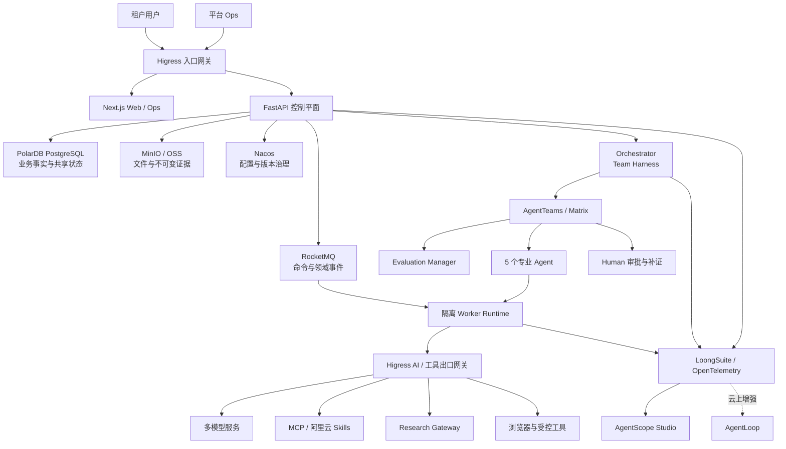

# 势能引擎技术架构基线 V1.0

> 项目英文名：LaunchScope  
> 状态：**FROZEN（已确认基线）**  
> 冻结日期：2026-08-05  
> 适用范围：社区版 V0.1、比赛 Demo、后续 SaaS 与企业私有化演进  
> 变更规则：任何影响本文件已确认边界的修改，必须新增 ADR，说明原因、影响、迁移和回滚方案；不得静默改写基线。

## 1. 文档目的

本文档固化势能引擎在架构确认对话中达成的共同理解，作为后续领域建模、接口设计、工程搭建、任务拆解、测试验收和比赛材料的唯一架构基线。

本文档依据：

- [GOAI Agent Infra 赛道官网](https://goaihz.com/tracks?track=infra)
- [Agent Infra（新智基座）赛道要求](../reference/goai-Agent-Infra（新智基座）赛道要求.txt)
- [势能引擎 Agent Infra 赛道实施方案 V2.0](../reference/势能引擎_AgentInfra赛道实施方案_V2.0_优化版.docx)

## 2. 产品定位与系统边界

势能引擎是一套**证据驱动的产品验证与决策基础设施**，用于帮助企业、创业团队、创新中心和评审机构持续判断：产品是否值得继续投入、当前最大问题是什么、下一步最应验证什么。

核心闭环：

```text
提交材料 -> 缺口诊断 -> 主动补问 -> 确认产品画像
-> 多 Agent 并行验证 -> 证据校准 -> 决策与报告
-> 产品修改 -> 同标准复验 -> 产品档案与经验沉淀
```

系统默认只自动执行只读动作：读取授权材料、浏览测试产品、检索公开信息、分析代码以及生成证据和报告。

中风险动作需要明确授权和受限凭据。发布、联系用户、发送邮件、写生产数据库、购买或付费调用等高风险动作必须先生成动作预览，经人工审批后进入独立受控执行通道。

势能引擎不是：

- 随意计算“爆款概率”的打分器。
- 把 AI 模拟用户当作真实用户证据的系统。
- 可以任意访问互联网或生产系统的通用自主 Agent。
- 由多个提示词顺序拼接而成的伪多 Agent 工作流。

## 3. 核心架构原则

1. **证据优先**：关键判断必须能够追溯至 Finding 和 Evidence。
2. **默认只读**：外部副作用必须受权限、预算、审批和审计约束。
3. **状态单一事实源**：PostgreSQL 是业务状态唯一事实来源。
4. **协作与执行分离**：Matrix 承载 Agent/Human 协作，RocketMQ 承载可靠后台命令和领域事件。
5. **运行可复验**：Run Manifest 冻结模型、Prompt、Skill、工具、规则、预算和测试标准。
6. **历史不可覆盖**：原始证据、Agent 输出、审批和决策历史采用追加写入。
7. **租户隔离贯穿全链路**：数据库、对象、消息、向量、缓存、Trace 和权限均绑定租户。
8. **厂商能力可替换**：领域模型不直接依赖云厂商 SDK，统一通过端口和适配器接入。
9. **失败关闭**：未知提交状态、有副作用或费用状态不明时立即暂停，不自动重试或切换。
10. **先闭环后扩张**：社区版 V0.1 只交付一个完整纵向闭环。

## 4. 总体架构



## 5. 技术栈与部署单元

### 5.1 应用技术栈

- 前端：Next.js + TypeScript。
- 控制平面：Python + FastAPI + Pydantic。
- AgentTeams Adapter / Orchestrator：Python。
- Skill Worker：Python，独立进程和隔离运行环境。
- API 契约：OpenAPI + JSON Schema。
- 事件契约：版本化 JSON Schema，事件携带关联和幂等标识。

### 5.2 代码布局

```text
apps/
  web/                  # 租户用户端
  ops/                  # 平台运营端
  api/                  # FastAPI 控制平面
  orchestrator/         # AgentTeams / Matrix 适配与运行控制
  worker/               # Skill 与工具任务执行器
packages/
  contracts/            # OpenAPI、JSON Schema、事件契约
  domain/               # 领域模型与规则
  skills/               # 版本化 Skill 包
  observability/        # OpenTelemetry 公共封装
infra/
  compose/
  kubernetes/
  higress/
  nacos/
  rocketmq/
  polardb/
  observability/
```

### 5.3 部署拓扑

采用“模块化单体控制平面 + 独立 Agent Worker 进程”：

- API、控制平面和业务模块保持一个后端应用边界。
- Orchestrator 负责 AgentTeams/Matrix 适配，不拥有业务事实。
- 浏览器、研究、代码分析和报告等长任务由独立 Worker Pool 执行。
- 本地和比赛版用 Docker Compose。
- 生产目标用 ACK/Kubernetes 和托管基础设施。

## 6. 推荐生态组件的职责

| 组件 | 势能引擎中的职责 |
|---|---|
| AgentTeams（原 HiClaw） | 强制多 Agent 协同基座，提供 Manager-Worker、Matrix 协作、人类介入和状态追踪 |
| 阿里云 Skills | 经统一 Skill/Tool 契约接入的云操作能力，按需选用而非整体部署 |
| Nacos | Agent Identity、Prompt、Skill、Model Policy、功能开关和非敏感运行配置的版本治理 |
| Higress | 入口鉴权与限流；模型、MCP、Skills 和外部 API 的安全出口、路由、预算与观测 |
| PolarDB for PostgreSQL | 业务事实、共享状态、产品档案、记忆、RAG、证据元数据和审计 |
| UnifiedModel | 跨 Agent、跨 Skill 和跨企业系统的统一语义及交换层，不替代事务模型 |
| RocketMQ | 异步命令、领域事件、长任务调度和可靠状态通知 |
| LoongSuite | OpenTelemetry 全链路采集 |
| AgentScope Studio | 开源比赛版的 Agent 轨迹展示和技术观测 |
| AgentLoop | 云上托管评测与生产观测增强，不与 AgentScope Studio 重复建设同类面板 |

组件全部纳入目标架构，但按阶段启用。评审和实施以必要性、接口契约、权限边界、可替换性和真实证据为准，不以组件数量为目标。

第一版不依赖 Redis。PostgreSQL 负责租约、幂等和检查点，RocketMQ 负责可靠事件，Higress 负责限流，Nacos 负责配置。只有经测量出现缓存或低延迟协调瓶颈时才引入 Redis，且 Redis 永不成为业务事实来源。

## 7. 租户、身份与部署模型

逻辑层级：

```text
Tenant -> Workspace -> Project -> ProductVersion -> EvaluationRun
```

- Demo 可以只有默认租户，但所有业务数据、证据、对象、消息、向量和 Trace 必须从第一天携带租户隔离信息。
- 默认 SaaS 使用共享 PolarDB PostgreSQL、共享 Schema 和 Row-Level Security。
- 高安全企业可采用独立数据库、对象存储桶、密钥和观测空间。
- 不采用“每租户一个 Schema”的中间方案。
- Tenant 管理员、Workspace 管理员、Project Owner、Reviewer、Viewer 和 Platform Operator 采用 RBAC。
- Agent 工具调用采用资源和动作级策略控制，校验主体、租户、项目、运行、Skill、工具、目标、风险、有效期和预算。
- 平台 Ops 与租户工作台分开域名、OAuth Client、会话和部署产物。
- 平台运维默认不能读取租户材料正文；紧急访问使用有时限、有理由、有审计的 Break-glass 流程。

## 8. AgentTeams、Matrix 与 Agent Identity

普通用户使用自研 Web UI。Matrix 是后台 Agent 协作总线，Element 是开发、运维和评委审计入口。

每个 Evaluation Run 映射为一个 AgentTeams Team / Matrix Room：

| Agent | 职责边界 |
|---|---|
| Evaluation Manager | 资料完整性、计划、任务拆解、冲突协调、审批请求和最终综合；不制造专业结论 |
| Product Engineering Agent | 产品操作、代码架构、交付能力和技术风险；不评价投资价值 |
| User Evidence Agent | 目标用户、访谈/试用设计、用户数据和证据缺口；AI 模拟不得冒充真实用户 |
| Business Investment Agent | 定价、成本、渠道、销售周期、竞争和投入条件 |
| Geo Policy Trend Agent | 地域政策、平台规则、准入、竞争窗口和信息有效期 |
| Evidence Auditor | 独立校验证据、冲突、时效和越权；只能通过、降级、驳回或要求补证 |

Human 是独立审批和补充信息主体，不算第七个 Agent。

Agent 只提交结构化 Finding 或状态变更请求，无权直接修改最终评审状态、长期记忆或正式报告。

## 9. 工作流、状态机与 Team Harness

### 9.1 固定阶段门与动态 DAG

固定阶段：

1. INTAKE
2. GAP_ANALYSIS
3. PROFILE_CONFIRMATION
4. PLANNING
5. PARALLEL_EVALUATION
6. EVIDENCE_REVIEW
7. REMEDIATION
8. SYNTHESIS
9. DOSSIER_COMMIT
10. VERSION_REGRESSION

主管 Agent 可在阶段内创建动态任务 DAG，但每项任务必须声明依赖、执行 Agent、Skill、预算、超时、成功条件和证据要求，并在执行前通过 Harness 校验。

### 9.2 运行状态机

```text
DRAFT -> INTAKE -> WAITING_FOR_USER -> PLANNED -> RUNNING
-> EVIDENCE_REVIEW -> WAITING_FOR_APPROVAL -> SYNTHESIZING -> COMPLETED

终止/异常状态：FAILED / CANCELLED / EXPIRED / NEEDS_ATTENTION
```

控制平面是状态提交者。Agent、Worker、Matrix 和消息消费者只能提出变更请求。

### 9.3 Run Manifest

每次运行冻结：

- 产品版本与材料清单。
- 评审目标、规则和测试任务。
- Agent Identity、Skill、Prompt、模型和工具版本。
- 地区、数据截止时间和时效范围。
- 总预算、子预算、超时、重试和证据要求。
- 审批点、安全策略、失败与降级规则。

V1/V2 默认继承相同标准。若评测标准变化，必须生成新标准版本，并把“同标准结果”和“新标准补充结果”分开报告。

## 10. Matrix、RocketMQ 与 PostgreSQL 的边界

- Matrix：Agent/Human 任务委派、结构化交接、补证、协作和人工介入。
- RocketMQ：启动 Run、执行 Skill、证据入库、报告生成、超时和通知等后台命令/事件。
- PostgreSQL：业务状态、幂等、审批、预算、审计和最终事实。

可靠事件采用 Transactional Outbox + Consumer Inbox：

1. 控制平面在同一数据库事务中更新业务状态并写 Outbox。
2. Publisher 将事件发送至 RocketMQ。
3. Worker 以至少一次语义消费，通过幂等键和唯一约束去重。
4. AgentTeams Adapter 校验 Matrix 结构化消息后再转为领域事件。

所有命令至少携带：`tenant_id`、`run_id`、`task_id`、`correlation_id`、`idempotency_key`、`schema_version`。

Matrix 不直接修改业务状态，RocketMQ 不传完整聊天记录和模型私密思维链。

## 11. API 与实时通信

- REST/OpenAPI：项目、版本、运行、审批、报告、权限和配置。
- SSE：任务进度、Agent 状态、工具摘要、补证和审批请求。
- S3 兼容签名 URL：文件上传、报告下载和证据查看。
- Webhook：后续企业系统通知。
- 暂不采用 GraphQL。
- 暂不为普通状态推送自建 WebSocket。

接口和事件必须版本化、使用统一错误码和 `correlation_id`，写操作支持幂等键，列表采用游标分页。SSE 断线后从数据库状态和事件游标恢复。

## 12. 领域模块

后端采用模块化单体，并落实“单表单写入所有者”：

- Identity & Tenant
- Project Dossier
- Evaluation
- Agent Orchestration
- Skill Registry
- Tool Gateway
- Evidence
- Memory & RAG
- Policy & Approval
- Decision & Report
- Usage & Quota
- Audit & Compliance
- Integration

模块间通过应用服务接口或领域事件交互。禁止跨模块直接写对方表，禁止循环依赖。基础设施放在 Adapter 层。

## 13. 核心数据模型

核心关系：

```text
Project -> ProductVersion -> EvaluationRun -> Stage -> Task
Task -> SkillInvocation -> ToolInvocation
Task -> Finding -> Evidence
Finding -> ConflictRecord
Finding -> Decision -> Report
EvaluationRun -> Approval / AuditEvent / UsageRecord
Project -> ProductDossier -> MemoryItem
```

### 13.1 不可变历史

- 原始 Evidence、Agent 输出、审批和 AuditEvent 追加写入，不覆盖。
- 新 Finding/Decision 使用 `supersedes_id` 指向旧版本。
- Product Dossier 可维护当前投影视图，但历史记录必须可追溯。
- 外部网页保存 URL、发布时间、抓取时间、适用地区、快照和内容哈希。
- Finding 必须引用 Evidence；无证据内容只能标记为 HYPOTHESIS。

### 13.2 对象存储

- PolarDB 保存结构化元数据。
- 本地使用 MinIO，阿里云使用 OSS。
- 原始文件、截图、录像、网页快照和报告保存在不可公开访问的对象存储中。
- 上传后校验哈希、大小、MIME 类型和恶意内容。
- 对象路径包含租户、项目、产品版本、运行和证据标识。
- 文本解析和向量是派生数据，删除原文件时同步清理。

### 13.3 UnifiedModel

UnifiedModel 描述 Product、Version、Run、Agent、Task、Skill、Tool、Hypothesis、Finding、Evidence、Decision 等实体和关系，用于跨 Agent 交接、外部系统映射、RAG 过滤和开放 Schema。

UnifiedModel 不替代 PostgreSQL 事务表，不负责状态迁移、预算扣减、审批和幂等。

## 14. 记忆与 RAG

四层上下文：

1. Run Context：单次运行临时上下文。
2. Project Memory：按租户和项目隔离的长期事实、历史问题与版本变化。
3. Evidence RAG：结构化过滤 + 全文索引 + 向量检索。
4. Reusable Knowledge：经过授权和脱敏的规则、模板、Skill 经验和通用失败模式。

Agent 不能直接写长期记忆，只能提交 MemoryCandidate。允许提交的内容包括用户确认事实、绑定证据且通过校准的 Finding；模拟意见必须保留“模拟”标签，政策、价格和趋势必须携带有效期。

检索顺序必须先过滤租户、项目、版本、地区、时间和权限，再做相似度排序，避免语义相似导致越权。

## 15. Skill 工程体系

Skill 是一等架构对象和版本化能力包，不是一次性提示词。

每个 Skill 包含：

- `skill.yaml` 元数据。
- 输入/输出 JSON Schema。
- 调用条件和前置条件。
- 工具、域名、数据和风险权限。
- 超时、重试、幂等和失败分类。
- 模型能力与预算上限。
- 证据输出要求。
- 单元、契约和样例测试。
- 升级、回滚和弃用策略。

首批六个 P0 Skill：

1. `product-intake-normalizer`
2. `intake-gap-diagnosis`
3. `browser-product-audit`
4. `business-investment-assessment`
5. `evidence-grounding-audit`
6. `version-regression-verification`

Nacos 保存已批准 Skill 的启用版本。Worker 隔离执行。Skill 默认只能返回结构化结果、证据或动作请求，不能直接修改业务状态。

## 16. MCP、工具与云 Skills

采用“MCP 优先、统一 Tool Contract、允许 Adapter 过渡”：

- 有稳定 MCP Server 的能力优先直接接入。
- 其他能力使用内部 Adapter，但 Schema、鉴权、错误、幂等和审计与 MCP 对齐。
- 阿里云官方 Skills 通过同一契约接入，不建立旁路。
- Agent/Skill 不依赖具体 SDK，后续迁移 MCP 只替换传输适配器。

每个工具必须声明版本、输入输出、风险、权限、域名、超时、重试、幂等、费用、证据要求和数据出境规则。

禁止 Agent 任意拼接 SQL、Shell 或 HTTP。数据库只能通过受限业务接口访问。代码仓库默认只读且不执行仓库脚本。

## 17. 模型治理

- 平台支持多模型，但每次 Run 冻结 Model Policy。
- 所有模型请求统一经过 Higress。
- Nacos 管理默认模型、允许备用模型、超时、Token、温度、预算和数据限制。
- V1/V2 默认使用同一模型、Prompt、Skill 和规则版本。
- 只读分析任务在明确未产生有效结果时可受控降级。
- 未知提交、已产生费用或有副作用时禁止自动重试、模型切换、工具切换和运行时切换。
- 每个 Run 和 Agent 都有预算；超额时暂停。
- 保存模型标识、版本、Token、费用、耗时、Trace 和输入输出摘要，不公开私密思维链。

## 18. 权限、凭据与审批

- 用户管理采用 RBAC，Agent 执行采用资源/动作级策略。
- Worker 不持有真实长期密钥，只持有短期能力令牌。
- 凭据存储在云密钥管理服务或 Kubernetes Secret，本地使用不入库的环境配置。
- Higress 代理真实凭据和外部调用。
- 高风险动作生成 ApprovalRequest，包含动作预览、影响范围、预计费用和过期时间。
- 审批令牌一次性使用，绑定工具、参数哈希和 Run；参数变化必须重新审批。
- Nacos、PostgreSQL、日志和 Matrix 均不得保存明文长期密钥。

## 19. 外部内容与网络安全

### 19.1 不可信内容摄取

用户上传的文档、网页和代码均为不可信数据：

1. 进入隔离区。
2. 校验类型、大小、压缩层级和哈希。
3. 扫描恶意文件、宏、脚本和压缩炸弹。
4. 在无凭据、受限网络的沙箱解析。
5. 标记来源和信任等级。
6. 检测提示注入、凭据诱导和越权内容。
7. 以 Untrusted Evidence 进入 Agent 上下文。

外部内容中的指令不能修改 Agent Identity、Skill 白名单、模型、预算、审批或系统规则。

### 19.2 分级联网

| 等级 | 能力 | 控制 |
|---|---|---|
| Public Research | 搜索公开网页和读取公开资料 | 经 Research Gateway，只允许公开 HTTPS、GET/HEAD、有限流量和预算 |
| Authenticated Research | 登录数据库、企业知识库或订阅内容 | 指定域名、账号和用户授权 |
| External Action | 提交、发布、购买、发消息或写外部系统 | 具体动作人工审批、幂等和审计 |

搜索结果只用于来源发现，不能直接作为事实证据。source-fetch 必须读取原文并记录发布机构、时间、地区、抓取时间和快照；优先一手来源。

所有网络层阻止内网、环回、云元数据地址、DNS 重绑定和未校验重定向。代码分析 Worker 默认无网络。

## 20. Higress 双网关模型

逻辑拆分：

- 入口网关：TLS、OIDC、WAF、租户限流、API 路由、上传策略和 SSE。
- AI/工具出口网关：模型、MCP、Skills、Research、短期令牌、域名动作策略、预算、熔断和脱敏。

Demo 可以共用一个 Higress 实例，但必须使用独立端口、路由、身份和策略。生产使用物理隔离的实例或等价安全边界。

## 21. Nacos、PostgreSQL 与 Secret 的边界

- Nacos：版本化 Agent/Prompt/Skill/Model/工具端点/功能开关和非敏感环境配置。
- PostgreSQL：租户、产品、运行、证据、预算、用量、审批、审计和运行冻结配置引用。
- Secret Manager：长期凭据和密钥。

Run 启动时读取批准配置并把版本及内容哈希写入 Run Manifest。运行期间普通配置变化不影响已启动 Run；紧急安全禁用可阻断后续调用，但必须记录审计。

## 22. 故障处理与恢复

失败分类：TRANSIENT、VALIDATION、AUTHORIZATION、DEPENDENCY、BUDGET、POLICY、SUBMISSION_UNKNOWN、BUSINESS。

- 只有明确无副作用且状态已知的瞬时失败可以有限指数退避重试。
- Schema 输出最多允许在原任务中修正一次，保留原始失败。
- 鉴权、策略和预算错误不自动重试。
- SUBMISSION_UNKNOWN 立即冻结，不切模型、工具或运行时，不重新提交。
- 有副作用的命令必须使用幂等键；只有明确返回“未执行”才可重试。
- Worker 从检查点恢复，已完成工具调用不得重复执行。
- 达到上限后进入 NEEDS_ATTENTION，由 Human 决定重试、跳过、降级或取消。

## 23. 决策与报告

规则引擎负责结构化等级和硬性阻断，大模型负责综合解释和可读报告。

维度等级：STRONG、MODERATE、WEAK、INSUFFICIENT_EVIDENCE。

阶段建议：PROCEED、VALIDATE_FURTHER、ADJUST、PAUSE。

- 四维不做简单平均。
- E0-E2 证据不能单独证明真实需求或商业模式成立。
- 合规红线和核心功能不可用等阻断项可覆盖其他优势。
- 报告每个关键判断必须可展开到 Finding 和 Evidence。
- 用户异议形成新版本，不覆盖原报告。

## 24. 可观测与隐私

Trace 层级：

```text
Evaluation Run
  -> Stage
    -> Agent Task
      -> Skill Invocation
        -> LLM Call / Tool Call / RAG Retrieval / Evidence Write
```

使用 LoongSuite/OpenTelemetry 采集 Trace、Log 和 Metrics；AgentScope Studio 为开源展示后端，AgentLoop 为云上增强。

记录运行、任务、Agent、Skill、模型、工具、Schema、耗时、错误、Token、费用、重试、证据、审批和降级信息。

完整 Prompt、模型输出和敏感正文默认不进入通用观测后端；只在受控业务证据库按权限和保留策略保存。Trace 保存哈希、版本、摘要和统计信息。

## 25. 数据保留与删除

默认生命周期：

- 临时上传与中间文件：7 天。
- 浏览器会话、Cookie 和临时凭据：任务结束即失效。
- 网页快照、截图和工具证据：90 天，可由租户调整。
- Product Dossier 与正式报告：保留至项目删除或合同到期。
- Trace 正文：30 天。
- 聚合 Metrics：1 年，不含业务正文。
- 审批与安全审计：1 年或企业配置。

删除任务必须清理数据库正文、向量、对象、缓存和派生索引。审计链只保留对象类型、时间、操作者、原因、哈希和删除结果，不保留原文。默认禁止跨租户学习和知识共享。

## 26. 调度、预算与容量

- 按租户公平调度，按浏览器、研究、代码和报告等任务类型隔离 Worker Pool。
- Run 预先生成并预留模型 Token、工具、搜索、浏览器时间和费用预算。
- 无法预留预算时进入 WAITING_FOR_BUDGET。
- Worker 使用租约领取任务；只有无副作用且状态明确的任务可在租约过期后重分配。
- 队列积压时可降低非关键研究深度，但不能跳过证据审查和安全步骤。

比赛/Demo 基线：

- 10 个以内活跃租户。
- 同时 3 个完整 Run。
- 每个 Run 最多 10 个并行 Agent Task。
- 同时 2 个浏览器 Worker。
- 单 Run 最多 100 条核心证据。
- 普通 API P95 小于 500ms，SSE 状态延迟目标小于 2 秒。

初期生产基线：100 个活跃租户、20 个并发 Run，Worker 横向扩展，证据分页和分区管理。

## 27. 可用性与灾难恢复

比赛版保证可恢复，不宣称高可用：允许单节点，但应用重启后可从 PostgreSQL 检查点恢复，已完成证据和任务不重复执行。

生产目标：

- Web、API、Orchestrator 和 Worker 多副本。
- Higress、Nacos、RocketMQ、Matrix 高可用。
- PolarDB 托管高可用与自动备份。
- OSS 版本、生命周期和必要的跨区域复制。
- API 月度可用性目标 99.9%。
- 普通业务数据 RPO 不高于 5 分钟。
- 控制平面 RTO 不高于 30 分钟。
- 灾难恢复后未知提交、有副作用和审批中任务保持暂停。

## 28. 测试与发布质量门

分层质量证据：

1. 静态、类型、依赖、密钥和许可证检查。
2. 领域规则和状态机单元测试。
3. API、事件、Matrix、Skill、MCP 和模型输出契约测试。
4. PolarDB、对象存储、Nacos、Higress、RocketMQ、Matrix 集成测试。
5. Skill 固定样例、失败、提示注入和越权评测。
6. Run Manifest / Harness 回归。
7. 租户隔离、SSRF、恶意文件、凭据和审批安全测试。
8. 提交到报告及版本复验的真实 E2E。

Mock、健康检查、单元测试和录像不能代替真实 E2E。付费外部调用不在普通 CI 中自动执行，必须使用测试环境、固定预算和明确授权。

## 29. CI/CD 与版本治理

- Pull Request 执行自动质量门。
- Merge 后构建不可变镜像、SBOM、签名和测试报告。
- 同一镜像依次晋级 Integration、Demo 和 Production。
- 生产晋级需要人工批准和部署后验证。
- Compose 和 Kubernetes 固定镜像摘要，不使用漂移的 latest。
- 数据库迁移只追加，不修改已发布迁移。
- 使用 Expand-Migrate-Contract 完成兼容升级。
- API、事件、Skill、Prompt、Agent Identity、规则、UnifiedModel 和 Run Manifest 分别版本化。
- 运行中的 Run 继续使用启动时冻结的旧能力版本。
- 事件消费者至少兼容当前和上一版 Schema。

## 30. 开源与商业边界

采用“完整可运行社区版开源，企业托管与专有连接器商业化”。

- 核心代码：Apache License 2.0。
- 文档：CC BY 4.0。
- 数据集：单独授权。
- 商标和 Logo 不随代码许可证自动授权。
- 使用 DCO 接受外部贡献，早期不引入较重 CLA。

社区版包含 Agent Identity、领域/事件 Schema、AgentTeams Adapter、Team Harness、核心 Skill、工具契约、证据模型、Compose、基础设施样例、观测示例、脱敏数据、测试和文档。

商业增强包括托管 SaaS、企业 SSO/合规、高级组织权限、专有连接器、大规模调度、SLA、私有化支持和合法授权的行业数据集。

## 31. 社区版 V0.1 范围

V0.1 必须完成：

- 租户、Workspace、Project、ProductVersion。
- 材料上传、隔离解析、产品画像、缺口诊断和补问。
- 1+5 Agent Identity 与 AgentTeams/Matrix 协作。
- 固定阶段门、动态 DAG 和 Run Manifest。
- 六个 P0 Skill。
- Research Gateway、只读浏览器工具和研究工具。
- Evidence、Finding、Conflict、Evidence Auditor。
- 四维规则判断和报告。
- Product Dossier、项目记忆和混合 RAG。
- V1/V2 同标准复验。
- 审批、预算、失败分类和审计。
- RocketMQ、Nacos、Higress、PolarDB 兼容数据库、MinIO。
- LoongSuite + AgentScope Studio。
- Docker Compose、样例数据、测试和部署文档。

V0.1 暂不包含：

- 大量行业模板和连接器。
- 任意代码执行。
- 自动发布、联系客户和生产写入。
- 复杂企业计费采购。
- 多区域高可用实装。
- 全功能平台 Ops。
- AgentLoop 深度托管集成。
- 多个真实产品案例。

V0.1 验收标准：新用户按 README 启动系统，导入样例材料，完成补问、多 Agent 协作、真实只读工具调用、证据审查、报告和一次版本复验。

## 32. 部署配置

| 配置 | 用途 | 方式 |
|---|---|---|
| Local | 开发、测试、评委本地运行 | Docker Compose 一键启动 |
| Demo | 在线演示与比赛答辩 | 阿里云受控环境 + 必要托管服务 |
| Production | 企业高可用部署 | ACK/Kubernetes + 托管 PolarDB、RocketMQ、OSS 等 |

三个配置使用相同容器镜像和配置 Schema，只改变基础设施规模和实现，不重写业务代码。

## 33. 待定但不阻塞架构的实施项

以下内容有意不在 V1.0 架构基线中冻结：

- 比赛使用的真实样例产品；CreaTrades 目前仅为候选，不是最终架构前提。
- 具体模型供应商、模型名称和版本。
- 首批选用的阿里云官方 Skills。
- 企业身份提供商。
- 云资源规格和区域。
- UI 视觉系统和行业模板。
- 商业计费模型。

这些选择必须遵守本文的权限、预算、证据、复验、隔离和可替换性原则。

## 34. 已冻结决策索引

| ID | 决策 |
|---|---|
| D-01 | 势能引擎是证据驱动的产品验证平台，不是任意外部执行平台 |
| D-02 | 逻辑多租户，默认 SaaS，保留企业私有化 |
| D-03 | PostgreSQL 是业务状态唯一事实来源，AgentTeams 是协同执行基座 |
| D-04 | 模块化单体控制平面 + 独立 Worker |
| D-05 | 目标架构纳入全部赛道推荐组件，但分阶段启用 |
| D-06 | 自研 Web UI 面向用户，Matrix/Element 面向协作与审计 |
| D-07 | Matrix、RocketMQ、PostgreSQL 三者职责分离 |
| D-08 | 业务状态可更新，证据与决策历史不可覆盖 |
| D-09 | 分层记忆和受控长期写入 |
| D-10 | 用户 RBAC + Agent 动作策略 + Higress 短期凭据 |
| D-11 | 平台多模型、单次 Run 冻结策略、受控降级 |
| D-12 | Skill 能力包、注册治理、隔离执行 |
| D-13 | MCP 优先、统一 Tool Contract、允许 Adapter 过渡 |
| D-14 | Next.js/TypeScript + Python/FastAPI |
| D-15 | Compose 支撑闭环，Kubernetes 为生产目标 |
| D-16 | 不可变 Run Manifest 与 Team Harness |
| D-17 | 1+5 Agent Identity 与严格职责边界 |
| D-18 | 固定阶段门 + 动态任务 DAG |
| D-19 | 失败分类和 fail-closed 重试 |
| D-20 | 全链路结构化观测，敏感正文留在受控证据库 |
| D-21 | 分类保留、可审计删除、默认禁止跨租户学习 |
| D-22 | 规则决定等级和阻断，模型负责解释 |
| D-23 | 样例产品后置，不作为通用架构前提 |
| D-24 | REST + SSE + 对象存储直传；内部 Matrix + RocketMQ |
| D-25 | 共享库 RLS 为默认，企业可独立数据库 |
| D-26 | 第一版不依赖 Redis |
| D-27 | PolarDB 存元数据，MinIO/OSS 存证据文件 |
| D-28 | 外部内容不可信、隔离解析、绝不授予指令权 |
| D-29 | 动态公开研究通过 Research Gateway；登录与动作分级授权 |
| D-30 | 租户公平调度、任务 Worker 隔离、执行前预算预留 |
| D-31 | 比赛版可恢复不冒充高可用，生产定义 RPO/RTO |
| D-32 | 分层测试和真实 E2E 发布质量门 |
| D-33 | 完整社区版开源，企业托管与专有连接器商业化 |
| D-34 | Apache-2.0 代码、CC BY 4.0 文档、数据单独授权 |
| D-35 | 领域模块和单表单写入所有者 |
| D-36 | Nacos 管运行配置、PostgreSQL 管事实、Secret Manager 管凭据 |
| D-37 | Higress 逻辑双网关，生产物理隔离 |
| D-38 | PostgreSQL 管事务，UnifiedModel 管统一语义 |
| D-39 | 用户工作台与平台 Ops 分离 |
| D-40 | 独立版本体系与 Expand-Migrate-Contract |
| D-41 | 比赛版和初期生产容量基线 |
| D-42 | 不可变镜像、逐环境晋级、人工生产门 |
| D-43 | 社区版 V0.1 交付一个完整纵向闭环 |

## 35. 后续交付顺序

1. 为关键决策建立独立 ADR。
2. 输出领域模型、数据库 ER 图和状态机规格。
3. 定义 Agent Identity、Skill、MCP、事件和 API Schema。
4. 建立 Monorepo 与 Docker Compose 工程骨架。
5. 把 V0.1 拆分为阶段任务和可执行验收矩阵。
6. 最后选择比赛样例产品，单独设计真实 Demo 和费用边界。

