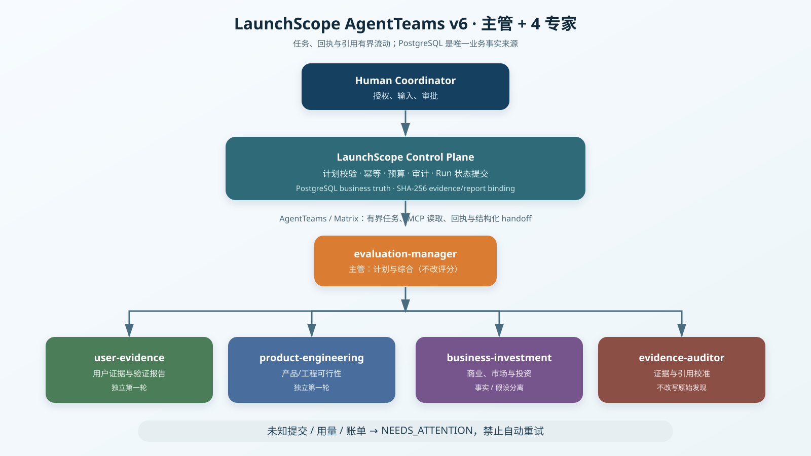
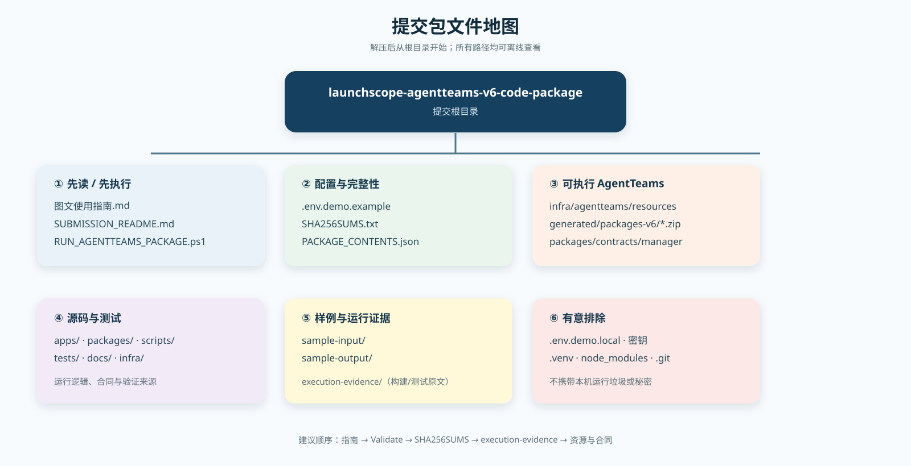
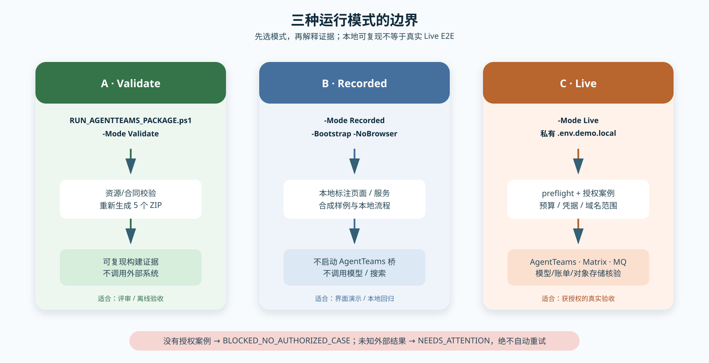

# LaunchScope AgentTeams v6 图文使用指南

这是一份给评审、部署人员和开发者使用的离线手册。所有图均为包内 SVG 矢量图，可直接在浏览器或 Markdown 阅读器中打开；它们是系统结构图，不是伪造的产品截图或 Live 运行证据。

## 1. 先看全貌：谁做什么



系统采用「主管 + 4 专家」的固定拓扑，共 5 个 Worker：

| 角色 | 负责内容 | 不负责的事 |
| --- | --- | --- |
| `evaluation-manager` | 拆解计划、接收审计输入、综合报告 | 改写确定性评分或直接写业务状态 |
| `user-evidence` | 用户证据与验证报告 | 自由调度其他 Worker |
| `product-engineering` | 产品/工程可行性报告 | 直接提交 Run 或绕过审计 |
| `business-investment` | 市场、商业与投资分析 | 把假设伪装成已验证事实 |
| `evidence-auditor` | 校准证据与引用、出具审计结果 | 改写专家原始发现 |

关键边界：PostgreSQL 是唯一业务事实来源；AgentTeams/Matrix 只运输有界任务、回执和引用。出现未知外部提交、用量或账单时，必须停在 `NEEDS_ATTENTION`，不自动重试。

## 2. 包里有什么：一分钟定位文件



最常用的入口和文件如下：

| 目标 | 打开或执行 |
| --- | --- |
| 先验证包可用 | `RUN_AGENTTEAMS_PACKAGE.ps1 -Mode Validate` |
| 本地依赖/配置说明 | `SUBMISSION_README.md` 与 `.env.demo.example` |
| AgentTeams 资源定义 | `infra/agentteams/resources/launchscope-team-v6.yaml` |
| 五个可导入 Worker 包 | `infra/agentteams/generated/packages-v6/*.zip` |
| 角色合同与运行清单 | `packages/contracts/manager/agents/*.v6.yaml`、`packages/contracts/manager/run-manifest.v6.json` |
| 本次构建与测试输出 | `execution-evidence/build-and-focused-test.txt` |
| 文件完整性校验 | `SHA256SUMS.txt` |

## 3. 先做本地验证（推荐给评审）

准备好 PowerShell 7、Python 3.11–3.13、Node.js 20.19+、pnpm 11.9 和 Docker Desktop 后，在解压目录执行：

```powershell
.venv\Scripts\python.exe -m pip install -e ".[dev]" -e packages/domain -e packages/contracts -e packages/skills -e packages/observability -e apps/api -e apps/orchestrator -e apps/worker
pnpm.cmd install --frozen-lockfile
pwsh -File .\RUN_AGENTTEAMS_PACKAGE.ps1 -Mode Validate
```

成功时会看到两次相同的资源检查（先 check、后 build）以及成功提示：

```text
validated AgentTeams agentteams.io/v1beta1: 1 Team, 5 Workers, 1 Human
validated AgentTeams agentteams.io/v1beta1: 1 Team, 5 Workers, 1 Human
AgentTeams v6 package validation and deterministic build succeeded.
```

这一步不需要 API Key，不调用模型，不提交外部任务。它会从当前源代码重新生成五个 Worker ZIP，并检查资源、合同和角色数量一致。

## 4. 三种运行模式：选对入口，避免误解证据



### A. Validate：交付验收/离线复核

```powershell
pwsh -File .\RUN_AGENTTEAMS_PACKAGE.ps1 -Mode Validate
```

验证资源结构、合同和 Worker ZIP。它是本包随附运行证据所对应的模式。

### B. Recorded：本地标注演示

```powershell
pwsh -File .\RUN_AGENTTEAMS_PACKAGE.ps1 -Mode Recorded -Bootstrap -NoBrowser
```

可启动本地标注的 Recorded 页面/服务，适合演示界面和本地流程。该模式不会启动 AgentTeams、Matrix、RocketMQ 桥，也不会调用模型或搜索，因此不能作为真实 E2E、商业预测准确率或计费成功的证明。

### C. Live：已授权的真实链路

```powershell
Copy-Item .env.demo.example .env.demo.local
# 仅在本机私有文件中填写数据库、对象存储、AgentTeams、Matrix 与模型网关参数
pwsh -File .\RUN_AGENTTEAMS_PACKAGE.ps1 -Mode Live -NoBrowser
```

Live 启动会先执行 preflight。必须有已授权案例、成本边界、模型网关、AgentTeams、Matrix、RocketMQ、PostgreSQL 与对象存储。缺少授权案例的正确状态是 `BLOCKED_NO_AUTHORIZED_CASE`，不是绕过检查继续运行。

## 5. 配置时只改哪里

不要编辑已打包的 Worker ZIP，也不要在 Git 或压缩包里放置密钥。复制 `.env.demo.example` 为 `.env.demo.local` 后，重点填写这些类别：

| 配置类别 | 典型变量 | 用途 |
| --- | --- | --- |
| 数据/对象存储 | `DATABASE_URL`、`LAUNCHSCOPE_S3_*` | 业务事实和证据对象 |
| AgentTeams/Matrix | `AGENTTEAMS_*`、`LAUNCHSCOPE_MATRIX_AGENT_ROOMS_JSON` | Worker、Human 与任务回执通道 |
| 模型网关 | `LAUNCHSCOPE_MODEL_UPSTREAM_*`、`LAUNCHSCOPE_MODEL_GATEWAY_SECRET` | 唯一可持有上游模型凭据的边界 |
| 运行保护 | `LAUNCHSCOPE_RUN_BUDGET_USD`、`MODEL_EGRESS_GATE_ENFORCED` | 成本限制和模型外发门控 |
| 授权案例 | `LAUNCHSCOPE_AUTHORIZED_CASE_URL`、`LAUNCHSCOPE_BROWSER_ALLOWED_DOMAINS` | Live 研究范围与案例授权 |

`LAUNCHSCOPE_SUPERVISOR_1P4_ENABLED=true`、`LAUNCHSCOPE_REPORT_V2_ENABLED=true` 和 `LAUNCHSCOPE_REPORT_V3_ENABLED=true` 是 v6 运行所需的默认开关。凭据留空时应失败关闭，不应改成假数据或绕过门控。

## 6. 如何验证文件没有被改动

PowerShell 可核验关键文件：

```powershell
Get-Content .\SHA256SUMS.txt
Get-FileHash .\RUN_AGENTTEAMS_PACKAGE.ps1 -Algorithm SHA256
Get-FileHash .\infra\agentteams\generated\packages-v6\evaluation-manager.zip -Algorithm SHA256
```

将实际摘要与 `SHA256SUMS.txt` 对应条目比较。包内还含有 `execution-evidence/build-and-focused-test.txt`，其中保存了资源验证、Worker ZIP 构建和 15 项针对性测试的原始文本输出。

## 7. 常见情况与正确处理

| 现象 | 优先检查 | 正确处理 |
| --- | --- | --- |
| 找不到 `.venv\Scripts\python.exe` | 依赖尚未按第 3 节安装 | 先建立仓库 `.venv`，再执行入口 |
| Validate 报 Worker 数或资源漂移 | `launchscope-team-v6.yaml` 与 v6 contracts | 不手改 ZIP；用源码重新执行 Validate |
| Live preflight 返回 `BLOCKED_NO_AUTHORIZED_CASE` | 授权案例/域名/成本配置 | 补齐授权后再启动，不要伪造案例 |
| `SUBMISSION_UNKNOWN` 或未知账单 | Run 级回执、模型用量、账单记录 | 保持 `NEEDS_ATTENTION`，不自动重试或切换供应商 |
| 需要演示但没有凭据 | 运行模式选择 | 使用 Recorded，并明确说明它不是 Live 证明 |

## 8. 评审建议顺序

1. 阅读本指南和 `SUBMISSION_README.md`。
2. 执行 `-Mode Validate`，确认 1 Team / 5 Workers / 1 Human。
3. 查看 `SHA256SUMS.txt` 与 `execution-evidence/`。
4. 审阅 `launchscope-team-v6.yaml`、五份 v6 Agent 合同和 `run-manifest.v6.json`。
5. 只有在已授权且具备成本/账单审计条件时，才进行 Live 验收。

这样可以把「包可复现」与「真实 Live 运行已闭环」清楚地区分开。
